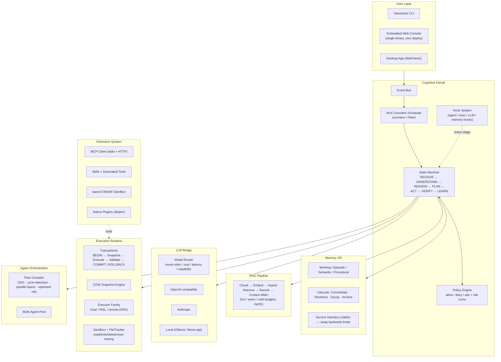

<div align="center">

# c-agent — Cognitive OS Runtime

**A complete "Cognitive Operating System" written in pure C11 — where the LLM is the accelerator, not the OS.**

[](https://en.wikipedia.org/wiki/C11_(C_standard_revision))
[](#build)
[](#third_party)
[](#testing--verification)
[](LICENSE)

*认知操作系统运行时：认知内核 · Memory OS · 多智能体编排 · 事务执行 · 插件生态 · 内嵌 Web 控制台*

</div>

---

## Why c-agent?

Most "agent frameworks" glue an LLM to a loop and hope for the best. **c-agent takes the operating-system view**: an agent runtime should have the same bones as an OS — a scheduler, a state machine, a policy/security layer, memory management, a transactional filesystem, and a process model — with the LLM plugged in as a *cognitive accelerator* that only runs when generalization is needed.

The result is a runtime that is:

| | Traditional agent framework | c-agent |
|---|---|---|
| Control flow | LLM decides everything, every step | **State machine + rule engine drive; LLM fills the gaps** |
| Memory | Chat log in a context window | **Memory OS with lifecycle: encode → consolidate → reinforce → decay → archive** |
| Safety | Prompt-level "please don't" | **Policy engine hard-intercepts actions; every LLM plan passes the same gate** |
| Side effects | Fire and forget | **Transactional: snapshot → execute → verify → commit / rollback** |
| Binary | node_modules + runtime | **A single static C binary with an embedded web console** |

One person can read the whole codebase. No Python. No Node. No Docker required. **Zero external dependencies** (only two vendored MIT libraries).

## Architecture at a Glance



> Full design doc: [`backend/docs/architecture-v1.0.md`](backend/docs/architecture-v1.0.md) (基线总纲, with sequence diagrams and module-to-code mapping)

## Highlights

### 🧠 Cognitive loop, not chat completion
Every request walks `RECEIVE → UNDERSTAND → REASON → PLAN → ACT → VERIFY → LEARN`. The bounded agent loop feeds action results back into context each round, detects stalls, and stops when the LLM returns plain text — with per-stage state machine events observable on the bus and via WebSocket.

### 💾 Memory OS with a real lifecycle
Four memory types (working / episodic / semantic / procedural) with **consolidation, reinforcement, time-based decay, threshold eviction and archiving** — all behind a clean **Memory Service interface (vtable)** so storage backends are swappable. Retrieval is hybrid: vector + keyword + char-bigram rerank, with optional **HyDE** (hypothetical document embeddings) for cold-tier queries.

### 🛡️ Security that doesn't live in the prompt
- **Policy engine**: explicit allow/deny/ask rules with risk scoring — **hard-intercepts** action execution before it happens (rule-primary, LLM-secondary)
- **Hook system**: horizontal layer dispatching on `agent.before_run`, `exec.before_execute`, state changes, errors — hooks can *block* runs, with built-in JSONL audit
- **Sandbox + FileTracker**: snapshots the filesystem before execution, diffs after, and reports every read/write/delete/exec as structured evidence
- **Capability tokens + WASM sandbox** (wasm3) for untrusted plugins

### ⚡ Transactions for file side effects
```
BEGIN → pre-capture snapshot → execute actions → validate → COMMIT
                            ↘ any failure → ROLLBACK (file-level undo)
```
Copy-on-write content store, 64 MB per-file capture guard (configurable), and **git-aware** mode that skips pre-capture in git-managed workspaces.

### 🎼 Multi-agent orchestration as a DAG
An LLM decomposes a goal into an agent roster, which becomes a **compiled Flow DAG**: Kahn's algorithm detects cycles and layers, nodes within a layer run in parallel, and node tasks can reference upstream results with `{{node-id}}` templates. Trace and results stream to the blackboard and web console.

### 🔌 LLM-agnostic, local-first
One unified vtable speaks **OpenAI-compatible and Anthropic** protocols, both with SSE streaming; works with DeepSeek, Claude, GPT, Qwen, **Ollama / llama.cpp** (one-click start from the console) or an offline mock. A model router balances by round-robin, cost, latency or capability tags. HTTP(S) via native WinHTTP on Windows and a dependency-free TCP client on Linux.

### 🧩 Extension ecosystem
MCP client (stdio + HTTP) with a curated plaza, skills marketplace, a **self-improving loop** (successful tool sequences are distilled into generated skills), AI plugin generation (analyze → architect → codegen → security audit → register), an optional federated marketplace server, and an IM bridge (Telegram).

### 🖥️ Ships like a product
The web console (React-free vanilla JS, ~100 KB) is **compiled into the binary**. A native **WebView2 desktop shell** and an **Inno Setup installer** turn it into a double-clickable Windows app — no console window, no separate browser, no runtime dependencies.

## Quick Start

```bash
git clone https://github.com/LeonQin-ai/cognitive-os-agent.git
cd c-agent/backend

# Windows (MSYS2 / Git Bash) — bundled Zig toolchain, no system compiler needed
./build.sh

# Linux — plain gcc
make

# Run the interactive CLI
./build/cagent
```

Start the server and open the console:

```bash
./build/cagent serve 8080
# → http://localhost:8080/  (embedded web console)
```

Drive it over HTTP:

```bash
curl -X POST localhost:8080/v1/chat -d '{"prompt":"Create note.txt with content hello"}'
curl localhost:8080/v1/tasks/0
curl localhost:8080/v1/tools          # registered tools
curl localhost:8080/v1/memory         # memory OS state
curl localhost:8080/metrics           # gauges: context.bytes_*, memory.*, tx.*
```

Point it at a real LLM (or run fully offline with the mock provider):

```json
{
  "llm.provider": "openai",
  "llm.base_url": "https://api.deepseek.com/v1",
  "llm.model": "deepseek-chat",
  "llm.api_key": "sk-..."
}
```

## Testing & Verification

Quality gate: **every change is verified on both Windows (zig cc) and Linux (gcc 12) — including an AddressSanitizer-clean run.**

```
unit:        1236 passed, 0 failed          (43 modules, 0 external deps)
scenario:    85 checks, 0 failed            (HTTP server, plugins, MCP stdio, flows)
e2e:         E2E PASS                       (openai + anthropic adapters, real HTTP)
adapters:    ADAPTER PASS                   (chat + SSE stream, both protocols)
bench:       BFCL-style 22 cases            (simple / multiple / parallel / irrelevance / policy)
ASAN:        0 memory errors                (heap-use-after-free / overflow clean)
```

Benchmark reports: [`backend/docs/benchmark-report-2026-08-31.md`](backend/docs/benchmark-report-2026-08-31.md) — real-LLM runs measure tool-selection accuracy, argument fidelity, parallel-call matching, policy adherence and latency.

## Repository Layout

```
backend/
├── include/cagent/     public headers — one per module, organized by layer
├── src/
│   ├── runtime/        event bus · M:N scheduler · state machine · policy · hooks
│   │                   flow compiler (DAG) · orchestrator · state store · agent pool
│   ├── cognition/      reasoning (bounded agent loop) · planner · evaluator · blackboard
│   ├── memory/         Memory OS facade · KV/vector/graph/episode stores · service vtable
│   ├── retrieval/      knowledge index · embeddings (local + rerank) · context builder (MMU)
│   ├── llm/            mock · openai · anthropic adapters · SSE · router · capabilities
│   ├── action/         tools (file/shell/git/mcp/skill/glob/grep) · MCP connections
│   ├── execution/      executor vtable: local · WSL · remote routing
│   ├── tx/ + snapshot/ transactions + COW snapshot engine
│   ├── plugin_runtime/ dynamic loader · wasm3 sandbox · capability tokens · filetracker
│   ├── plugin_intelligence/ analyzer · architect · codegen · security · testing
│   ├── api/            HTTP/1.1 server · REST · WebSocket (RFC6455 from scratch) · auth
│   ├── im/             IM channels · Telegram bridge
│   ├── os/             threads · coroutines (ucontext/Fiber) · sockets · proc · fs
│   └── infra/          logging · config · metrics · audit · ring buffer (lock-free MPMC)
├── apps/web/           embedded web console (compiled into the binary)
├── cli/                interactive CLI
├── tools/              mock-llm-server · desktop shell (WebView2) · installer assets
├── tests/              unit · scenario · e2e · adapters · BFCL-style benchmark
├── docs/               architecture v1.0 baseline · v2 control/data plane · benchmark report
└── third_party/        cJSON (MIT) · wasm3 (MIT) · webview (MIT)
```

## Documentation

| Doc | Content |
|---|---|
| [`backend/docs/architecture-v1.0.md`](backend/docs/architecture-v1.0.md) | 架构基线总纲：总体图、认知闭环、Memory OS、Context MMU、Hook 系统、时序图、模块映射 |
| [`backend/docs/architecture-design-v2.md`](backend/docs/architecture-design-v2.md) | 控制面/数据面分离设计、企业级路线（多租户、集群、部署） |
| [`backend/docs/benchmark-report-2026-08-31.md`](backend/docs/benchmark-report-2026-08-31.md) | Agent 基准评测方法与真实 LLM 结果 |
| [`backend/README.md`](backend/README.md) | 开发者文档：构建、并发模型、API、配置、市场/本地模型 |

## Design Principles

1. **LLM is the accelerator, not the OS.** Rule engine + state machine own the control flow; the LLM is consulted only where generalization is required.
2. **Everything is observable.** Event bus, JSONL audit, metrics gauges, WebSocket push — no hidden state.
3. **Zero-dependency C11.** If it can't be vendored in ~3 files, it doesn't come in.
4. **Safety is enforced, not requested.** Policy, hooks and sandbox act *before* side effects happen.
5. **Dual-platform from day one.** Every commit builds and passes tests on Windows and Linux.

## Roadmap

- [x] Cognitive kernel + M:N coroutine scheduler + transactions
- [x] Memory OS lifecycle + Memory Service interface
- [x] Flow DAG orchestration (parallel layers, upstream refs)
- [x] Policy hard-interception + hook system + file-tracker sandbox
- [x] WSL / remote (SSH) executors
- [ ] Cluster executor + node scheduling (control-plane split, v2)
- [ ] OS-level sandbox (job objects / namespaces) for the shell tool
- [ ] Symbol-aware code index (tree-sitter quality without the dependency)
- [ ] SWE-bench-style harness (sandboxed test-and-grade loop)

## Contributing

The codebase is deliberately small and layered — a new contributor can read one layer per sitting. PRs welcome: pick a module from the layout above, keep the C11 + zero-dependency discipline, and run the test suite on both platforms.

## License

[MIT](LICENSE) — vendored third-party code keeps its own MIT headers (cJSON, wasm3, webview).

---

<div align="center">

*If you find this project interesting — a full cognitive OS in portable C — please give it a ⭐.*

</div>
