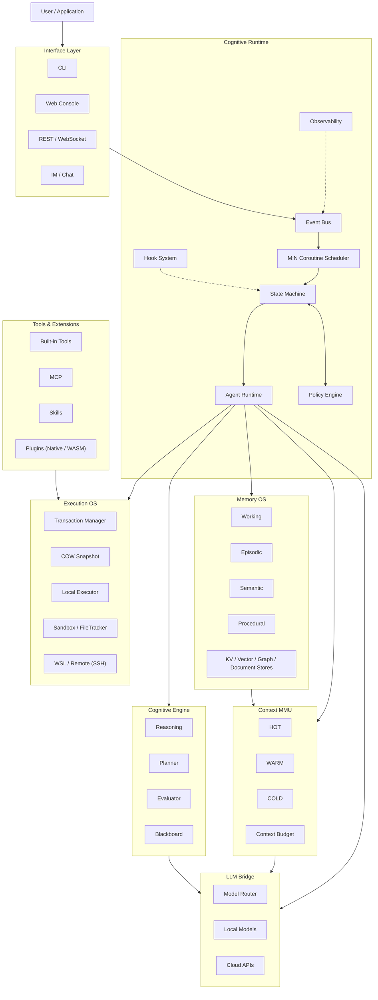

<div align="center">

# Cognitive OS

**A C-native runtime for autonomous AI agents — LLM is the accelerator, not the OS.**

[](https://en.wikipedia.org/wiki/C11_(C_standard_revision))
[](#quick-start)
[](#project-structure)
[](#testing)
[](LICENSE)

**[中文文档](README.zh-CN.md)**

</div>

---

Cognitive OS is a lightweight, model-agnostic **Agent Runtime / Cognitive Operating System** written in pure C11.

Most agent systems are a prompt loop:

```
User → Prompt → LLM → Tool → LLM → Tool → ...
```

Cognitive OS treats an agent as a **runtime-managed process**:

```
User / Application
        │
        ▼
┌─────────────────────┐
│    Cognitive OS     │
│    Agent Runtime    │
└──────────┬──────────┘
           │
   ┌───────┼────────┐
   ▼       ▼        ▼
 Memory  Context  Execution
  OS       MMU       OS
   │       │        │
   └───────┼────────┘
           ▼
      LLM / Tools
```

The runtime owns **state, scheduling, memory, context, execution, security, isolation and observability**. The LLM is invoked only when generalization, reasoning or semantic understanding is required.

## Why Cognitive OS?

An autonomous agent eventually becomes a **systems problem**. It needs lifecycle management, asynchronous execution, scheduling, memory management, context management, process isolation, tool permissions, transactional side effects, rollback, multi-agent coordination, observability, resource management, sandboxing and remote execution.

Cognitive OS moves these responsibilities **out of the prompt and into the runtime**.

| | Traditional agent framework | Cognitive OS |
|---|---|---|
| Control flow | LLM decides everything, every step | **State machine + rule engine drive; LLM fills the gaps** |
| Memory | Chat log in a context window | **Memory OS with a real lifecycle: encode → consolidate → reinforce → decay → archive** |
| Context | Stuff everything into the prompt | **Context MMU: hot/warm/cold tiers with budget, promotion and eviction** |
| Safety | Prompt-level "please don't" | **Policy engine hard-intercepts actions before they happen** |
| Side effects | Fire and forget | **Transactional: snapshot → execute → verify → commit / rollback** |
| Concurrency | Sequential tool loop | **M:N coroutine scheduler, parallel DAG layers** |
| Binary | node_modules + runtime | **A single static C binary with an embedded web console** |

The goal is not another prompt framework — it is the **runtime substrate underneath autonomous agents**.

## Architecture



## The Cognitive Loop

An agent is not a chat completion. Cognitive OS models an agent as a **stateful control loop driven by the runtime**:

```
RECEIVE → UNDERSTAND → RECALL → REASON → PLAN → POLICY CHECK
      → SNAPSHOT → ACT → VERIFY → COMMIT / ROLLBACK → LEARN
                                                      │
                                      └──→ next cycle
```

A deterministic state machine handles lifecycle, retries, timeouts, scheduling, policy enforcement, tool dispatch, transaction boundaries and failure handling. The LLM is used for semantic understanding, planning, reasoning, decomposition and generalization — the parts that actually need a model.

This makes the system far less dependent on the model's ability to hold the entire control flow inside a context window.

## Cognitive Runtime

The kernel-like core: agent lifecycle, state machine, event bus, **M:N coroutine scheduler** (ucontext on Linux, fibers on Windows), agent pool, policy engine, hook system, capability system and observability.

Agent workloads are naturally asynchronous. The coroutine scheduler runs many cheap agent tasks over a small thread pool instead of coupling every operation to an OS thread — a foundation for asynchronous I/O, distributed scheduling, agent isolation and resource quotas.

## Memory OS

Memory is not a vector database. It is a **lifecycle-managed subsystem**:

```
ENCODE → STORE → RECALL → CONSOLIDATE → REINFORCE → DECAY → ARCHIVE
```

| Type | Purpose |
|---|---|
| Working | Current task state and short-term reasoning |
| Episodic | Previous agent experiences |
| Semantic | Facts, knowledge and learned concepts |
| Procedural | Skills, workflows and successful action sequences |

Storage is abstracted behind a **Memory Service interface (vtable)** — KV, vector, graph and document stores are swappable; the runtime never depends on a specific database.

## Context MMU

A context window is treated as **managed memory**, not an infinitely expandable prompt:

| Tier | Content |
|---|---|
| **HOT** | Current goal, plan, active tool call, latest results, errors |
| **WARM** | Recent observations, related memories, previous tool results, code fragments |
| **COLD** | Historical tasks, documentation, large repositories, archived knowledge |

The Context MMU decides what to load, what to keep out, what to promote, what to evict, and how much budget remains — so the agent can operate over large knowledge bases without stuffing everything into the prompt.

RAG is part of this pipeline (not a bolted-on chatbot feature): chunk → embed → **hybrid retrieval** (vector + keyword) → **rerank** → context builder → Context MMU → LLM, with optional **HyDE** for cold-tier queries.

## Transactional Execution

Agents modify the real world, so execution needs **transaction semantics**:

```
BEGIN → SNAPSHOT → EXECUTE → VERIFY
                        ├── success → COMMIT
                        └── failure → ROLLBACK (file-level undo)
```

- Copy-on-write snapshot engine (runtime-native — git may *inform* it, but git is not the transaction mechanism)
- 64 MB per-file capture guard (configurable), git-workspace aware
- Works for arbitrary files, temporary workspaces, generated code, build artifacts, sandbox and remote execution

## Execution OS

Execution is abstracted behind an executor interface: `execute(command, capability, policy, environment)` — the runtime picks the backend.

```
Executor ── Local ── Linux / Windows
         ├─ Sandbox ── WASM (wasm3) + FileTracker
         ├─ WSL
         └─ Remote ── SSH
```

FileTracker snapshots the filesystem before execution, diffs it after, and reports every read/write/delete/exec as structured evidence.

## Security & Policy

Security must not live in the prompt:

```
Agent Plan → Policy Engine → Hook System → Capability Check → Executor → Audit
```

Policy decisions are **ALLOW / DENY / ASK** with risk scoring, over tool, command, path, network, plugin, agent and execution environment. Rules **hard-intercept** before any side effect — the LLM cannot talk its way past them.

Hooks provide a second horizontal interception layer (`agent.before_run`, `exec.before_execute`, `llm.before_request`, `memory.before_write`, …) and can observe, modify or **veto** an operation.

## Multi-Agent Runtime

Agents behave like **isolated runtime instances** — each with its own memory, context, tools and policy — not multiple prompts sharing one global chat log:

```
Supervisor → Task compiled into a Flow DAG
   ├── Analyze   (layer 0)
   ├── Search    (layer 0)     ← independent nodes run in parallel
   └── Inspect   (layer 0)
        └── Merge → Execute → Verify   (dependent layers)
```

The Flow compiler validates the DAG (Kahn's algorithm: cycle detection + layering), executes each layer in parallel, and supports `{{node-id}}` references so downstream nodes consume upstream results.

## LLM Bridge

Deliberately model-agnostic. One unified interface speaks **OpenAI-compatible and Anthropic** protocols (both with SSE streaming) — DeepSeek, Claude, GPT, Qwen, **Ollama / llama.cpp** (one-click start from the console) or an offline mock. A model router balances by round-robin, cost, latency or capability tags. The same runtime runs offline, on a local GPU, against a cloud API, or on a remote inference cluster.

## Tools & Extension System

A unified capability model: built-in tools (file / shell / git / glob / grep), **MCP** (stdio + HTTP), skills marketplace, generated tools (successful tool sequences are **distilled into reusable skills** — a self-improvement loop), native C plugins and **WASM plugins** (wasm3 sandbox + capability tokens). The AI plugin generator runs analyze → architect → codegen → **security audit** → test → register; the runtime still decides whether the generated capability may execute.

## Observability

Everything important is observable: every stage of the cognitive loop publishes events on the bus; JSONL audit trail; Prometheus-style metrics; WebSocket push to the console. An agent run can be fully reconstructed — essential for debugging autonomous systems.

## A Typical Agent Run

> "Find the kernel regression and fix it."

```
1. Understand the request
2. Recall previous debugging experience      (episodic memory)
3. Retrieve relevant source / documentation  (RAG)
4. Ask the LLM for reasoning, generate plan  (planner)
5. Policy check                              (policy engine)
6. Create snapshot                           (COW snapshot)
7. Inspect → Modify → Build → Run regression test
8. Verify  ── PASS ──→ COMMIT
           └─ FAIL ──→ ROLLBACK → re-plan → retry
9. Learn: experience → episodic memory
          → consolidation → semantic / procedural memory
```

The system does not simply answer — it **executes, verifies and learns**.

## Design Principles

1. **LLM is the accelerator, not the OS.** The runtime owns deterministic control flow.
2. **Context is a managed resource** — allocation, budget, promotion, eviction, persistence.
3. **Memory has a lifecycle** — not just an embedding dump in a vector store.
4. **Side effects are transactional** — execute → verify → commit, or rollback.
5. **Security is enforced by the runtime** — policy, capability, hook, sandbox, audit. Not "please don't run `rm -rf`".
6. **Core abstractions are replaceable** — storage, LLM providers, executors and plugins connect through stable interfaces.
7. **Everything important is observable.**
8. **C is the runtime substrate.** The model provides cognition; the runtime provides execution.

## Project Structure

```
cognitive-os-agent/
├── backend/
│   ├── include/cognitive-os-agent/   public headers — one per module, by layer
│   ├── src/
│   │   ├── runtime/         event bus · M:N scheduler · state machine · policy · hooks
│   │   │                    flow compiler (DAG) · orchestrator · state store · agent pool
│   │   ├── cognition/       reasoning (bounded agent loop) · planner · evaluator · blackboard
│   │   ├── memory/          Memory OS facade · KV/vector/graph/episode stores · service vtable
│   │   ├── retrieval/       knowledge index · embeddings · rerank · context builder (MMU)
│   │   ├── llm/             openai · anthropic adapters · SSE · router · capabilities
│   │   ├── action/          tools (file/shell/git/mcp/skill/glob/grep) · MCP connections
│   │   ├── execution/       executor vtable: local · WSL · remote routing
│   │   ├── tx/ + snapshot/  transactions + COW snapshot engine
│   │   ├── plugin_runtime/  dynamic loader · wasm3 sandbox · capability tokens · filetracker
│   │   ├── plugin_intelligence/  analyzer · architect · codegen · security audit
│   │   ├── api/             HTTP/1.1 server · REST · WebSocket (RFC6455) · auth
│   │   ├── im/              IM channels · Telegram bridge
│   │   ├── os/              threads · coroutines · sockets · processes · fs
│   │   └── infra/           logging · config · metrics · audit · lock-free MPMC ring buffer
│   ├── apps/web/            embedded web console (compiled into the binary)
│   ├── cli/                 interactive CLI
│   ├── tools/               mock-llm-server · desktop shell (WebView2) · installer assets
│   ├── tests/               unit · scenario · e2e · adapters · BFCL-style benchmark
│   ├── docs/                architecture v1.0 · v2 control/data plane · benchmark report
│   └── third_party/         cJSON (MIT) · wasm3 (MIT) · webview (MIT)
├── LICENSE
└── README.md
```

The architecture is intentionally layered — each layer exposes stable interfaces instead of leaking implementation details upward:

```
Application → Agent Runtime → Cognitive/Memory/Execution Services → OS Abstraction → Operating System
```

## Quick Start

```bash
git clone https://github.com/LeonQin-ai/cognitive-os-agent.git
cd cognitive-os-agent/backend

# Linux
make

# Windows (MSYS2 / Git Bash) — bundled Zig toolchain, no system compiler needed
./build.sh

# Run the interactive CLI
./build/cognitive-os-agent

# Start the web console
./build/cognitive-os-agent serve 8080
# → http://localhost:8080/
```

Drive it over HTTP:

```bash
curl -X POST localhost:8080/v1/chat -d '{"prompt":"Create note.txt with content hello"}'
curl localhost:8080/v1/tasks/0    # inspect a task
curl localhost:8080/v1/tools      # registered tools
curl localhost:8080/v1/memory     # Memory OS state
curl localhost:8080/metrics       # gauges: context.bytes_*, memory.*, tx.*
```

Point it at a real LLM (or run fully offline with the mock provider):

```json
{
  "llm.provider": "openai",
  "llm.base_url": "https://api.deepseek.com/v1",
  "llm.model": "deepseek-chat",
  "llm.api_key": "sk-..."
}
```

## Testing

Quality gate: **every change is verified on both Windows (zig cc) and Linux (gcc 12), including an AddressSanitizer-clean run.**

```
unit:      1236 passed, 0 failed   (43 modules, 0 external deps)
scenario:  85 checks, 0 failed     (HTTP server, plugins, MCP stdio, flows)
e2e:       E2E PASS                (real HTTP, both protocols)
adapters:  ADAPTER PASS            (chat + SSE stream, openai + anthropic)
bench:     BFCL-style 22 cases     (simple / multiple / parallel / irrelevance / policy)
ASAN:      0 memory errors
```

Benchmark methodology and real-LLM results: [`backend/docs/benchmark-report-2026-08-31.md`](backend/docs/benchmark-report-2026-08-31.md).

## Documentation

| Doc | Content |
|---|---|
| [`backend/docs/architecture-v1.0.md`](backend/docs/architecture-v1.0.md) | Architecture baseline: diagrams, cognitive loop, Memory OS, Context MMU, hooks, sequence diagrams, module mapping |
| [`backend/docs/architecture-design-v2.md`](backend/docs/architecture-design-v2.md) | Control plane / data plane split, enterprise roadmap (multi-tenant, cluster, deployment) |
| [`backend/docs/benchmark-report-2026-08-31.md`](backend/docs/benchmark-report-2026-08-31.md) | Agent benchmark methodology and real-LLM results |
| [`backend/README.md`](backend/README.md) | Developer docs: build, concurrency model, API, configuration, marketplace, local models |

## Roadmap

The project evolves from a local agent runtime toward a distributed agent operating environment.

**Phase 1 — Cognitive Runtime** ✅
Agent lifecycle · event bus · M:N coroutine runtime · state machine · policy / hooks · agent orchestration

**Phase 2 — Cognitive Memory** ✅
Memory OS abstraction · working/episodic/semantic/procedural memory · retrieval · Context MMU
→ memory consolidation → reflection → long-term procedural learning

**Phase 3 — Execution OS** ✅
Local execution · transactions / snapshots · file tracking · WSL / remote (SSH) executors · WASM sandbox
→ OS-level sandbox (job objects / namespaces) → VM → containers

**Phase 4 — Multi-Agent Runtime** ✅
Flow DAG orchestration · parallel agent execution · per-agent isolation
→ resource quotas → capability isolation → agent-level scheduling

**Phase 5 — Distributed Agent Runtime** 🔜
Distributed scheduler · remote agent nodes · workload placement · node health management · centralized observability · node scheduling (control-plane split)

**Phase 6 — Enterprise Cognitive OS** 🔜
Multi-tenancy · RBAC / ABAC · centralized policy · distributed memory · enterprise model routing · audit

The same runtime supports two deployment modes: **personal** (local-first, single binary) and **enterprise** (a control plane managing a fleet of agent nodes — the enterprise layer manages the fleet rather than replacing the runtime).

## Why C?

Not because "C is faster" — because the runtime sits **close to the operating system**. C gives direct control over memory, threads, coroutines, scheduling, sockets, processes, filesystem, IPC, signals, resource ownership and ABI boundaries. An agent runtime increasingly resembles **OS + database + scheduler + sandbox + AI runtime**; the model itself does not need to be implemented in C, the runtime does.

## What Makes This Different?

Cognitive OS is not competing with agent frameworks on prompt abstractions — its architectural boundary is different:

```
Agent Framework            Cognitive OS
───────────────            ─────────────────────────────────────
LLM                        ┌───────────────────────────────────┐
│                          │ Cognitive Runtime                 │
Prompt / Chain             │ state / scheduler / events        │
│                          │ policy / hooks / capability       │
Tools                      │ agent lifecycle / isolation       │
│                          └──────────────┬────────────────────┘
Memory                     Memory OS │ Context MMU │ Execution OS
                                          │ LLM Bridge
                                    local / cloud / GPU
```

The central idea: **an autonomous agent needs an operating environment, not just a prompt loop.**

## Project Status

An active research / engineering project, evolving:

```
Single-node Agent Runtime → Multi-Agent Runtime → Sandboxed Runtime
→ Remote Runtime → Distributed Runtime → Enterprise Agent Operating Platform
```

The current implementation establishes the runtime primitives first.

## Contributing

The codebase is deliberately small and layered — a new contributor can read one layer per sitting. Particularly interesting areas: scheduler / coroutine / event bus (runtime), planner / evaluator / reflection (cognition), memory service / retrieval / Context MMU (memory), sandbox / VM / remote executor / snapshot (execution), multi-agent / DAG / isolation (agent), observability / distributed control plane (infrastructure).

PRs welcome: pick a module, keep the C11 + zero-dependency discipline, keep the core architecture modular, preserve the runtime boundary, and run the test suite on both platforms.

## License

[MIT](LICENSE) — vendored third-party code keeps its own MIT headers (cJSON, wasm3, webview).

---

<div align="center">

**Build the runtime underneath autonomous intelligence.**

*If you find this project interesting — a full cognitive OS in portable C — please give it a ⭐.*

</div>
