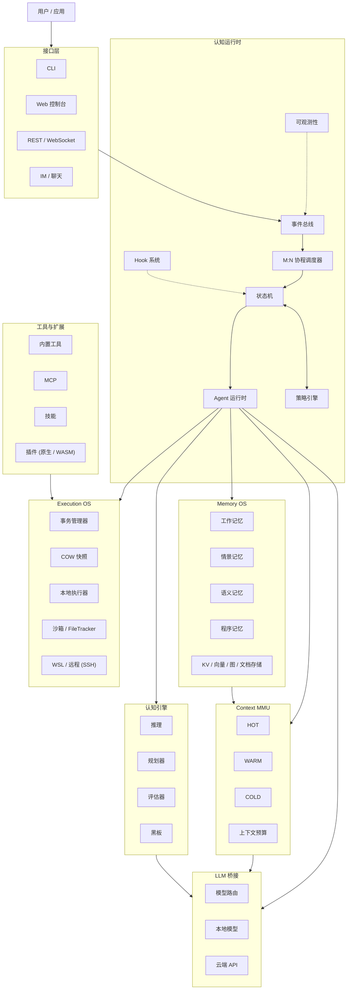

<div align="center">

# Cognitive OS（认知操作系统）

**C 原生的自主智能体运行时 —— LLM 是加速器，不是操作系统。**

[](https://en.wikipedia.org/wiki/C11_(C_standard_revision))
[](#快速开始)
[](#项目结构)
[](#测试与验证)
[](https://github.com/LeonQin-ai/cognitive-os-agent/actions/workflows/ci.yml)
[](LICENSE)

**[English](README.md)**

</div>

---

Cognitive OS 是一个用纯 C11 编写的轻量级、模型无关的**智能体运行时 / 认知操作系统**。

大多数 Agent 系统本质是一条提示词循环：

```
User → Prompt → LLM → Tool → LLM → Tool → ...
```

Cognitive OS 把 Agent 当作**由运行时管理的进程**：

```
用户 / 应用
        │
        ▼
┌─────────────────────┐
│    Cognitive OS     │
│    Agent 运行时      │
└──────────┬──────────┘
           │
   ┌───────┼────────┐
   ▼       ▼        ▼
 Memory  Context  Execution
  OS       MMU       OS
   │       │        │
   └───────┼────────┘
           ▼
      LLM / Tools
```

运行时拥有**状态、调度、内存、上下文、执行、安全、隔离与可观测性**；只有当需要泛化、推理或语义理解时才调用 LLM。

## 为什么需要 Cognitive OS？

一个自主 Agent 最终会变成**系统问题**：它需要生命周期管理、异步执行、调度、内存管理、上下文管理、进程隔离、工具权限、事务化副作用、回滚、多智能体协同、可观测性、资源管理、沙箱与远程执行。

Cognitive OS 把这些职责**从提示词里搬进运行时**：

| | 传统 Agent 框架 | Cognitive OS |
|---|---|---|
| 控制流 | LLM 每一步决定一切 | **状态机 + 规则引擎驱动，LLM 只补空隙** |
| 记忆 | 上下文窗口里的聊天记录 | **真正的记忆生命周期：编码→巩固→强化→衰减→归档** |
| 上下文 | 全部塞进 prompt | **Context MMU：hot/warm/cold 三层预算、晋升与淘汰** |
| 安全 | 提示词层面的"请不要" | **策略引擎在动作发生前硬拦截** |
| 副作用 | 做完拉倒 | **事务化：快照→执行→验证→提交 / 回滚** |
| 并发 | 顺序工具循环 | **M:N 协程调度器，DAG 分层并行** |
| 产物 | node_modules + 运行时 | **单个静态 C 二进制，内嵌 Web 控制台** |

目标不是再造一个提示词框架，而是打造**自主智能体之下的运行时基座**。

## 架构



## 认知循环

Agent 不是一次聊天补全。Cognitive OS 把 Agent 建模为**由运行时驱动的有状态控制循环**：

```
RECEIVE → UNDERSTAND → RECALL → REASON → PLAN → POLICY CHECK
      → SNAPSHOT → ACT → VERIFY → COMMIT / ROLLBACK → LEARN
                                                      │
                                      └──→ 下一轮循环
```

确定性的状态机负责生命周期、重试、超时、调度、策略执行、工具分发、事务边界与失败处理；LLM 只负责语义理解、规划、推理、任务分解与泛化——真正需要模型的部分。

这使系统远不那么依赖"模型在上下文窗口里维持整个控制流"的能力。

## 认知运行时

类内核的核心：Agent 生命周期、状态机、事件总线、**M:N 协程调度器**（Linux 用 ucontext，Windows 用 Fiber）、Agent 池、策略引擎、Hook 系统、能力系统与可观测性。

Agent 负载天然异步。协程调度器让大量廉价的 Agent 任务跑在少量线程之上，而不是把每个操作绑死一个 OS 线程——为异步 I/O、分布式调度、Agent 隔离与资源配额打下地基。

## Memory OS

记忆不是向量数据库，而是**有生命周期的子系统**：

```
ENCODE → STORE → RECALL → CONSOLIDATE → REINFORCE → DECAY → ARCHIVE
```

| 类型 | 用途 |
|---|---|
| 工作记忆 | 当前任务状态与短期推理 |
| 情景记忆 | Agent 的既往经历 |
| 语义记忆 | 事实、知识与学到的问题解决方案 |
| 程序记忆 | 技能、工作流与成功的动作序列 |

存储抽象在 **Memory Service 接口（vtable）**之后——KV、向量、图、文档存储皆可替换，运行时从不依赖某个具体数据库。

## Context MMU

上下文窗口被当作**受管内存资源**，而不是可以无限膨胀的 prompt：

| 层级 | 内容 |
|---|---|
| **HOT** | 当前目标、计划、活跃工具调用、最新结果、错误 |
| **WARM** | 近期观察、相关记忆、历史工具结果、代码片段 |
| **COLD** | 历史任务、文档、大型仓库、归档知识 |

Context MMU 决定加载什么、挡在外面什么、晋升什么、淘汰什么、预算还剩多少——Agent 因此可以在大知识库上工作，而不用把一切都塞进 prompt。

RAG 是这条流水线的一部分（不是外挂的聊天功能）：分块 → 嵌入 → **混合检索**（向量 + 关键词）→ **重排** → 上下文构建 → Context MMU → LLM，冷层查询支持可选 **HyDE**。

## 事务化执行

Agent 会修改真实世界，所以执行需要**事务语义**：

```
BEGIN → SNAPSHOT → EXECUTE → VERIFY
                        ├── 成功 → COMMIT
                        └── 失败 → ROLLBACK（文件级撤销）
```

- 写时复制（COW）快照引擎（运行时原生——git 可以*辅助*它，但 git 不是事务机制）
- 单文件 64 MB 捕获上限（可配置），git 工作区感知
- 适用于任意文件、临时工作区、生成代码、构建产物、沙箱与远程执行

## Execution OS

执行抽象在执行器接口之后：`execute(command, capability, policy, environment)` ——运行时选择后端。

```
Executor ── Local ── Linux / Windows
         ├─ Sandbox ── WASM (wasm3) + FileTracker
         ├─ WSL
         └─ Remote ── SSH
```

FileTracker 在执行前快照文件系统、执行后做差分，把每一次读/写/删/执行记录为结构化证据。

## 安全与策略

安全不能只住在提示词里：

```
Agent 计划 → 策略引擎 → Hook 系统 → 能力检查 → 执行器 → 审计
```

策略决策为 **ALLOW / DENY / ASK** 加风险评分，作用于工具、命令、路径、网络、插件、Agent 与执行环境。规则在任何副作用发生前**硬拦截**——LLM 无法用话术绕过。

Hook 提供第二层横向拦截（`agent.before_run`、`exec.before_execute`、`llm.before_request`、`memory.before_write`……），可以观察、修改或**否决**一个操作。

## 多智能体运行时

多个 Agent 表现为**隔离的运行时实例**——各自拥有记忆、上下文、工具与策略——而不是共享一份全局聊天记录的多个提示词：

```
Supervisor → 任务编译为 Flow DAG
   ├── Analyze   (第 0 层)
   ├── Search    (第 0 层)     ← 无依赖节点并行执行
   └── Inspect   (第 0 层)
        └── Merge → Execute → Verify   （依赖层）
```

Flow 编译器校验 DAG（Kahn 算法：判环 + 分层），层内并行执行，支持 `{{node-id}}` 引用让下游节点消费上游结果。

## LLM 桥接

刻意做到模型无关。统一接口同时讲 **OpenAI 兼容与 Anthropic** 两种协议（均支持 SSE 流式）——DeepSeek、Claude、GPT、Qwen、**Ollama / llama.cpp**（控制台一键启动）或离线 mock。模型路由按轮询、成本、延迟或能力标签均衡。同一套运行时可以离线跑、本地 GPU 跑、云端 API 跑或远程推理集群跑。

## 工具与扩展系统

统一的能力模型：内置工具（file / shell / git / glob / grep）、**MCP**（stdio + HTTP）、技能市场、生成工具（成功的工具序列被**蒸馏为可复用技能**——自进化闭环）、原生 C 插件与 **WASM 插件**（wasm3 沙箱 + 能力令牌）。AI 插件生成器走 分析 → 架构 → 代码生成 → **安全审计** → 测试 → 注册；是否允许生成的能力执行，仍由运行时决定。

## 可观测性

一切重要操作皆可观测：认知循环每个阶段都向总线发布事件；JSONL 审计轨迹；Prometheus 风格指标；WebSocket 推送到控制台。一次 Agent 运行可以被完整重放——这对调试自主系统至关重要。

## 一次典型的 Agent 运行

> "找到内核回归并修复它。"

```
1. 理解请求
2. 回忆既往调试经历                       （情景记忆）
3. 检索相关源码 / 文档                     （RAG）
4. 让 LLM 推理，生成执行计划               （规划器）
5. 策略检查                               （策略引擎）
6. 创建快照                               （COW 快照）
7. 查看 → 修改 → 编译 → 跑回归测试
8. 验证   ── 通过 ──→ 提交
          └─ 失败 ──→ 回滚 → 重新规划 → 重试
9. 学习：经历 → 情景记忆
         → 巩固 → 语义 / 程序记忆
```

系统不是简单回答——它**执行、验证并从执行中学习**。

## 设计原则

1. **LLM 是加速器，不是操作系统。** 运行时拥有确定性控制流。
2. **上下文是受管资源** —— 分配、预算、晋升、淘汰、持久化。
3. **记忆有生命周期** —— 不只是向量库里的一堆 embedding。
4. **副作用是事务化的** —— 执行 → 验证 → 提交，或回滚。
5. **安全由运行时强制执行** —— 策略、能力、Hook、沙箱、审计。不是"请不要执行 `rm -rf`"。
6. **核心抽象皆可替换** —— 存储、LLM 提供方、执行器、插件都通过稳定接口接入。
7. **一切重要的东西皆可观测。**
8. **C 是运行时基座。** 模型提供认知，运行时提供执行。

## 项目结构

```
cognitive-os-agent/
├── backend/
│   ├── include/cognitive-os-agent/   公共头文件 —— 每模块一个，按层组织
│   ├── src/
│   │   ├── runtime/         事件总线 · M:N 调度器 · 状态机 · 策略 · Hook
│   │   │                    Flow 编译器 (DAG) · 编排器 · 状态存储 · Agent 池
│   │   ├── cognition/       推理（有界 agent 循环）· 规划器 · 评估器 · 黑板
│   │   ├── memory/          Memory OS 门面 · KV/向量/图/情景存储 · 服务 vtable
│   │   ├── retrieval/       知识索引 · 嵌入 · 重排 · 上下文构建 (MMU)
│   │   ├── llm/             openai · anthropic 适配器 · SSE · 路由 · 能力
│   │   ├── action/          工具 (file/shell/git/mcp/skill/glob/grep) · MCP 连接
│   │   ├── execution/       执行器 vtable：本地 · WSL · 远程路由
│   │   ├── tx/ + snapshot/  事务 + COW 快照引擎
│   │   ├── plugin_runtime/  动态加载 · wasm3 沙箱 · 能力令牌 · filetracker
│   │   ├── plugin_intelligence/  分析器 · 架构师 · 代码生成 · 安全审计
│   │   ├── api/             HTTP/1.1 服务器 · REST · WebSocket (RFC6455) · 鉴权
│   │   ├── im/              IM 渠道 · Telegram 桥
│   │   ├── os/              线程 · 协程 · 套接字 · 进程 · 文件系统
│   │   └── infra/           日志 · 配置 · 指标 · 审计 · 无锁 MPMC 环形缓冲
│   ├── apps/web/            内嵌 Web 控制台（编译进二进制）
│   ├── cli/                 交互式 CLI
│   ├── tools/               mock-llm-server · 桌面壳 (WebView2) · 安装包素材
│   ├── tests/               单元 · 场景 · e2e · 适配器 · BFCL 风格基准
│   ├── docs/                架构 v1.0 · v2 控制/数据面 · 基准报告
│   └── third_party/         cJSON (MIT) · wasm3 (MIT) · webview (MIT)
├── LICENSE
└── README.md
```

架构刻意分层——每层暴露稳定接口，不向上一层泄漏实现细节：

```
应用 → Agent 运行时 → 认知/记忆/执行服务 → OS 抽象 → 操作系统
```

## 快速开始

```bash
git clone https://github.com/LeonQin-ai/cognitive-os-agent.git
cd cognitive-os-agent/backend

# Linux
make

# Windows（MSYS2 / Git Bash）—— 捆绑 Zig 工具链，无需系统编译器
./build.sh

# 运行交互式 CLI
./build/cognitive-os-agent

# 启动 Web 控制台
./build/cognitive-os-agent serve 8080
# → http://localhost:8080/
```

通过 HTTP 驱动：

```bash
curl -X POST localhost:8080/v1/chat -d '{"prompt":"创建 note.txt，内容为 hello"}'
curl localhost:8080/v1/tasks/0    # 查看任务
curl localhost:8080/v1/tools      # 已注册工具
curl localhost:8080/v1/memory     # Memory OS 状态
curl localhost:8080/metrics       # 指标：context.bytes_*、memory.*、tx.*
```

接入真实 LLM（或用 mock 提供方完全离线运行）：

```json
{
  "llm.provider": "openai",
  "llm.base_url": "https://api.deepseek.com/v1",
  "llm.model": "deepseek-chat",
  "llm.api_key": "sk-..."
}
```

## 测试与验证

质量门槛：**每次改动都在 Windows（zig cc）与 Linux（gcc 12）双平台验证，包含 AddressSanitizer 无报错运行。**

```
unit:      1236 passed, 0 failed   （43 个模块，0 外部依赖）
scenario:  85 checks, 0 failed     （HTTP 服务器、插件、MCP stdio、Flow）
e2e:       E2E PASS                （真实 HTTP，双协议）
adapters:  ADAPTER PASS            （chat + SSE 流式，openai + anthropic）
bench:     BFCL 风格 22 条          （simple / multiple / parallel / irrelevance / policy）
ASAN:      0 内存错误
```

### 自己动手跑测试

所有测试套件自包含，**不需要 API key、不需要外网、不需要任何外部服务**（LLM 用 mock）。所有测试二进制失败时都以非零码退出。

**Linux（gcc）：**

```bash
cd backend
make                # 构建全部测试二进制（或 make test / make scenario 构建并运行单项）
make test           # 单元测试            → "1236 passed, 0 failed"
make scenario       # 场景检查            → "SCENARIO PASS"
./build/test-adapters            # 适配器检查          → "ADAPTER PASS"
./build/cognitive-os-agent-bench --mock   # 基准 sanity（离线 mock）
./build/mock-llm-server 9000 &    # e2e 需要先启动 mock LLM 服务器
./build/cognitive-os-agent-e2e   #                      → "E2E PASS"
```

**Windows（MSYS2 / Git Bash，捆绑 Zig 工具链）：**

```bash
cd backend
./build.sh                               # 全量构建
./build/cognitive-os-agent-test.exe      # 单元测试
./build/cognitive-os-agent-scenario.exe  # 场景检查
./build/test-adapters.exe                # 适配器检查
./build/cognitive-os-agent-bench.exe --mock
./build/mock-llm-server.exe 9000 & ./build/cognitive-os-agent-e2e.exe
```

| 套件 | 二进制 | 验证内容 |
|---|---|---|
| unit | `cognitive-os-agent-test` | 全部 43 个模块：状态机、事件总线、调度器、记忆生命周期、Context MMU、事务、策略、Hook、Flow…… |
| scenario | `cognitive-os-agent-scenario` | 端到端场景：HTTP API、插件、MCP stdio、Flow、大文件快照保护 |
| adapters | `test-adapters` | LLM 提供方协议：chat + SSE 流式（openai + anthropic，真实 HTTP） |
| e2e | `cognitive-os-agent-e2e` | 对 mock LLM 服务器（`mock-llm-server 9000`）的完整 agent 运行 |
| bench | `cognitive-os-agent-bench --mock` | BFCL 风格基准 harness 离线 sanity |

> bench-real / bench-bfcl 用 `--mock` 也是离线的；`--real` 会通过 `COA_LLM_*` 环境变量（provider / base_url / model / api_key）访问真实 LLM——仅在你有 API key 时使用。

**CI** 在每次 push 和 pull request 时运行同样的套件——Linux（gcc）、Linux（AddressSanitizer）、Windows（zig cc）。见 [`.github/workflows/ci.yml`](.github/workflows/ci.yml)。

基准评测方法与真实 LLM 结果：[`backend/docs/benchmark-report-2026-08-31.md`](backend/docs/benchmark-report-2026-08-31.md)。

## 文档

| 文档 | 内容 |
|---|---|
| [`backend/docs/architecture-v1.0.md`](backend/docs/architecture-v1.0.md) | 架构基线：总体图、认知闭环、Memory OS、Context MMU、Hook、时序图、模块映射 |
| [`backend/docs/architecture-design-v2.md`](backend/docs/architecture-design-v2.md) | 控制面/数据面分离、企业级路线（多租户、集群、部署） |
| [`backend/docs/benchmark-report-2026-08-31.md`](backend/docs/benchmark-report-2026-08-31.md) | Agent 基准评测方法与真实 LLM 结果 |
| [`backend/README.md`](backend/README.md) | 开发者文档：构建、并发模型、API、配置、市场、本地模型 |

## 路线图

项目从本地 Agent 运行时逐步演进为分布式智能体运行环境。

**阶段 1 —— 认知运行时** ✅
Agent 生命周期 · 事件总线 · M:N 协程运行时 · 状态机 · 策略 / Hook · Agent 编排

**阶段 2 —— 认知记忆** ✅
Memory OS 抽象 · 工作/情景/语义/程序记忆 · 检索 · Context MMU
→ 记忆巩固 → 反思 → 长期程序学习

**阶段 3 —— Execution OS** ✅
本地执行 · 事务 / 快照 · 文件追踪 · WSL / 远程 (SSH) 执行器 · WASM 沙箱
→ OS 级沙箱（job objects / namespaces）→ VM → 容器

**阶段 4 —— 多智能体运行时** ✅
Flow DAG 编排 · Agent 并行执行 · 逐 Agent 隔离
→ 资源配额 → 能力隔离 → Agent 级调度

**阶段 5 —— 分布式 Agent 运行时** 🔜
分布式调度器 · 远程 Agent 节点 · 负载放置 · 节点健康管理 · 集中可观测性 · 节点调度（控制面拆分）

**阶段 6 —— 企业级 Cognitive OS** 🔜
多租户 · RBAC / ABAC · 集中策略 · 分布式记忆 · 企业模型路由 · 审计

同一套运行时支持两种部署形态：**个人版**（本地优先，单二进制）与**企业版**（一个管理 Agent 节点集群的控制面——企业层管理机群，而不是替换底层运行时）。

## 为什么用 C？

不是因为"C 更快"，而是因为运行时**贴近操作系统**。C 对内存、线程、协程、调度、套接字、进程、文件系统、IPC、信号、资源所有权与 ABI 边界提供直接控制。一个 Agent 运行时越来越像 **OS + 数据库 + 调度器 + 沙箱 + AI 运行时** 的合体；模型本身不需要用 C 实现，运行时需要。

## 我们有何不同？

Cognitive OS 不在提示词抽象上与其他 Agent 框架竞争——它的架构边界不同：

```
Agent 框架                  Cognitive OS
───────────────             ─────────────────────────────────────
LLM                         ┌───────────────────────────────────┐
│                           │ 认知运行时                         │
Prompt / Chain              │ 状态 / 调度 / 事件                 │
│                           │ 策略 / Hook / 能力                 │
工具                         │ Agent 生命周期 / 隔离              │
│                           └──────────────┬────────────────────┘
记忆                         Memory OS │ Context MMU │ Execution OS
                                           │ LLM 桥接
                                     本地 / 云端 / GPU
```

核心理念：**自主智能体需要的是一个操作系统环境，而不只是一条提示词循环。**

## 项目状态

一个活跃的研究 / 工程项目，持续演进：

```
单节点 Agent 运行时 → 多智能体运行时 → 沙箱化运行时
→ 远程运行时 → 分布式运行时 → 企业智能体操作平台
```

当前实现优先建立运行时原语。

## 参与贡献

代码库刻意保持小而分层——新贡献者每次研读一层即可。尤其有价值的方向：调度器 / 协程 / 事件总线（运行时）、规划器 / 评估器 / 反思（认知）、记忆服务 / 检索 / Context MMU（记忆）、沙箱 / VM / 远程执行器 / 快照（执行）、多智能体 / DAG / 隔离（Agent）、可观测性 / 分布式控制面（基础设施）。

欢迎 PR：选一个模块，遵守 C11 + 零依赖纪律，保持核心架构模块化、守住运行时边界，并让测试套件通过——本地运行方式见[测试与验证](#测试与验证)（无需 API key）。

## 许可证

[MIT](LICENSE) —— 第三方 vendored 代码保留各自的 MIT 头（cJSON、wasm3、webview）。

---

<div align="center">

**构建自主智能之下的运行时。**

*如果这个项目——一个用可移植 C 写成的完整认知操作系统——让你感兴趣，请给个 ⭐。*

</div>
