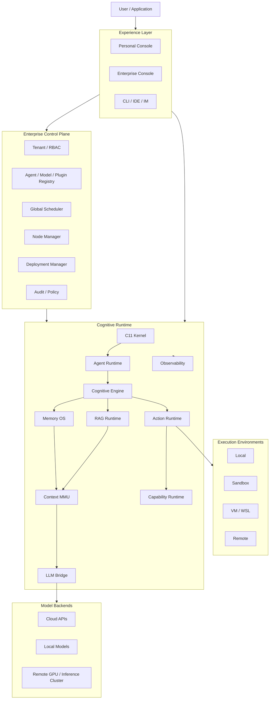
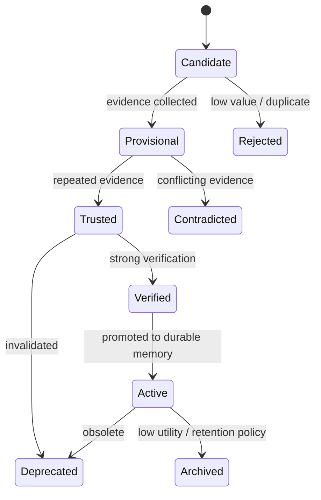
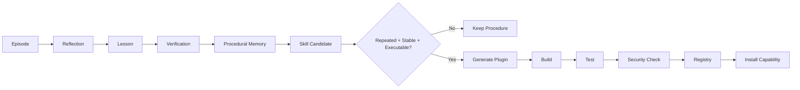
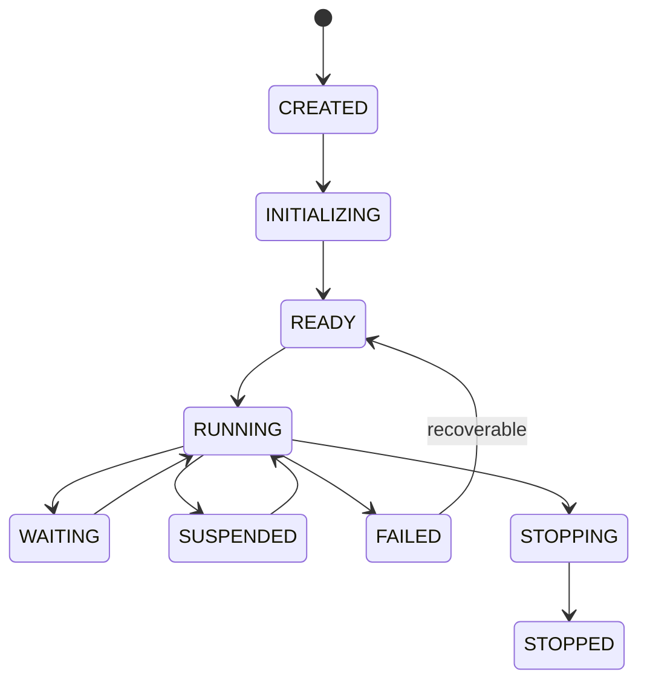
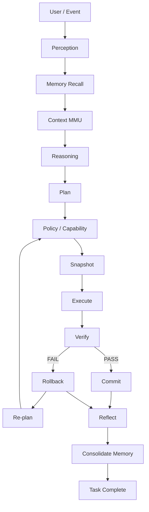
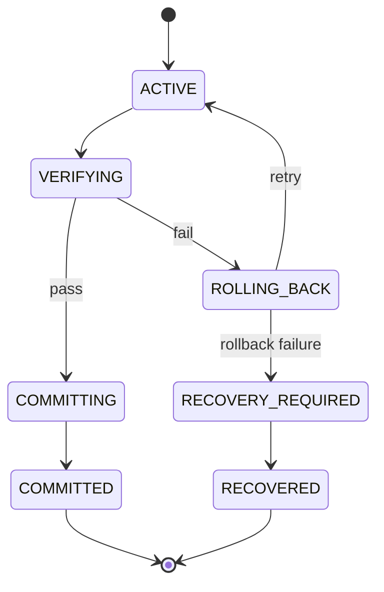

# Cognitive OS Detailed Design Document (DDD) v1.1

> Status: Architecture Baseline / Design Review Candidate  
> Scope: Personal Edition + Enterprise Edition shared runtime  
> Primary implementation: C11  
> Selective Rust: trust-boundary / protocol components only  
> Design thesis: **LLM is the accelerator, not the OS.**

---

## 1. Document Purpose

This document freezes the v1.1 architecture baseline for Cognitive OS and is intended to be directly consumable by developers, AI coding agents, reviewers and QA.

The document defines:

- business/engineering goals and non-goals;
- architecture and component boundaries;
- Memory OS and Context MMU detailed design;
- Agent lifecycle and execution semantics;
- LLM Bridge and model abstraction;
- Plugin / MCP / Skills capability system;
- transactional execution and COW snapshots;
- Personal and Enterprise edition boundaries;
- API, data model and failure semantics;
- observability, security, testing and release strategy;
- comparative positioning against DeepSeek Harness, OpenAI Codex CLI and Claude Code;
- known weaknesses and mitigation strategy.

This is an implementation baseline, not a claim that every component is already production-complete.

Implementation status is tracked in Section 37. The roadmap describes target architecture; it must not be read as a completed-feature checklist.

---

# 2. Background and Design Objectives

## 2.1 Background

A conventional Agent can be modeled as:

```text
User
 ↓
Prompt
 ↓
LLM
 ↓
Tool
 ↓
Result
 ↓
LLM
```

This abstraction is sufficient for short-lived tasks but becomes fragile when an Agent must:

- operate for a long time;
- maintain durable state;
- execute side effects safely;
- recover from failure;
- use large external knowledge bases;
- coordinate multiple Agents;
- run in heterogeneous environments;
- switch between local/cloud/remote models;
- learn reusable procedures from previous execution.

Cognitive OS treats an Agent as a runtime-managed execution entity.

```text
Agent
 ├── State
 ├── Scheduler
 ├── Memory
 ├── Context
 ├── Capability
 ├── Policy
 ├── Execution
 └── Observability
```

The LLM is therefore a compute provider for semantic reasoning, planning and generalization rather than the owner of the whole system control loop.

## 2.2 Design Goals

### P0

- C11 runtime kernel.
- M:N coroutine scheduling.
- Unified event loop.
- Explicit Agent / Task state machines.
- Hook and ABI extension points.
- Local execution backend.
- Model-agnostic LLM Bridge.
- Persistent Markdown-based Long-Term Memory.
- Context MMU with **independent** L0/L1/L2 representation and HOT/WARM/COLD residency.
- Transaction + snapshot + rollback.
- Policy and capability enforcement.
- Structured observability.

### P1

- Multi-Agent isolation and coordination.
- MCP / Skills / Plugin runtime.
- Memory reflection and consolidation.
- Sandbox execution.
- Remote execution.
- Enterprise Control Plane.
- Node management.

### P2

- WSL / VM execution.
- Agent migration.
- distributed memory;
- GPU-aware scheduling;
- cross-node replay;
- enterprise multi-tenancy and fleet operations.

## 2.3 Non-Goals

- Implementing foundation models.
- Reimplementing QEMU/KVM/SPDK.
- Building a new general-purpose vector database.
- Using Git as the runtime transaction system.
- Rewriting the entire system in Rust.
- Adding distributed consensus to the Personal Edition.

---

# 3. Capacity Targets and SLO/SLA Baseline

These values are engineering targets for benchmarking, not measured production claims.

## 3.1 Personal Edition

| Metric | Target |
|---|---:|
| Active users | 1 |
| Concurrent logical Agent Tasks | 1–20 |
| Concurrent model requests | 1–8 |
| Durable Memory items | 10^4–10^5 |
| Lightweight event dispatch | ≥10k events/s target on modern desktop |
| p95 local metadata lookup | <5 ms |
| p95 local control-path event dispatch | <2 ms, excluding model/network latency |
| 100k-memory index rebuild | <60 s target on SSD |

## 3.2 Enterprise Cluster

| Metric | Initial Target |
|---|---:|
| Agents / node | 100–1,000 logical Agents |
| Concurrent logical Tasks / cluster | 1,000–10,000 |
| Heartbeat interval | 2–5 s |
| Failure detection | <15 s |
| Control Plane availability | 99.9% target |
| Task state durability | acknowledged state recoverable after process restart |

## 3.3 Token Budget Targets

Typical coding/debugging workload:

- simple task: 1–3 model calls;
- complex task: 3–10 model calls;
- default recall: L0-first, then L1 for top candidates;
- L2 loading is demand driven;
- every model call records input/output tokens and the context plan that caused the load.

The system optimizes **total task cost**, not token count alone:

```text
Task Cost
 = LLM tokens
 + embedding cost
 + rerank cost
 + storage I/O
 + network cost
 + runtime CPU
 + latency
```

---

# 4. Terminology and Core Distinctions

| Term | Meaning |
|---|---|
| Perceptual Memory | Short-lived sensory/event information |
| Working Memory | Current task state and active reasoning state |
| Long-Term Memory | Durable knowledge/experience/procedures |
| Episode | Factual record of what happened |
| Experience | Interpreted task outcome + observations |
| Lesson | Generalized conclusion from an experience |
| Procedural Memory | Reusable knowledge of how to perform a procedure |
| Skill | Packaged procedural capability |
| Plugin | Executable extension capability |
| Context MMU | Manages active model context as a runtime working set |
| L0/L1/L2 | **Representation granularity**: summary / overview / detail |
| HOT/WARM/COLD | **Residency/cache state**: active / cached / cold |
| RAG | Retrieval from external knowledge/resources |
| Snapshot | Recoverable state/workspace checkpoint |
| Transaction | Side-effect boundary with commit/rollback semantics |
| Cognitive Node | Managed runtime worker in Enterprise Edition |
| Control Plane | Enterprise-wide scheduling, registry and policy layer |

### Fundamental invariant

> **L0/L1/L2 and HOT/WARM/COLD are orthogonal dimensions.**

L0/L1/L2 describe what representation exists for a memory item. HOT/WARM/COLD describe whether that representation/data is resident in fast runtime memory/cache.

Example:

```text
Memory A
 ├── L0 summary
 ├── L1 overview
 └── L2 detail

Runtime residency:
 ├── HOT  : L2 loaded
 ├── WARM : L1 loaded
 └── COLD : only metadata/index resident
```

A single memory may be `HOT+L0`, `HOT+L2`, `WARM+L1`, etc.

---

# 5. Overall Architecture



## 5.1 Plane Separation

### Data plane

Runs the Agent workload:

```text
Kernel
Agent Runtime
Memory
Context
Reasoning
LLM Bridge
Execution
Plugin
```

### Control plane

Manages the fleet:

```text
Tenant
RBAC
Registry
Scheduling
Deployment
Node health
Resource policy
Audit
```

The Personal Edition does not require the full Control Plane.

---

# 6. Component Responsibilities

## 6.1 Cognitive Kernel

Provides mechanisms only:

- coroutine;
- event loop;
- scheduler;
- task primitive;
- IPC primitive;
- resource primitive;
- hook dispatch;
- plugin ABI loader.

It must not directly contain:

- model provider logic;
- business-specific workflows;
- prompt orchestration;
- vector database implementation;
- enterprise tenant policy.

## 6.2 Agent Runtime

Owns:

- Agent lifecycle;
- Task lifecycle;
- Agent namespace;
- capability attachment;
- memory/context namespace;
- multi-agent coordination;
- agent-local policy.

## 6.3 Cognitive Engine

Owns:

```text
Perception
Attention
Reasoning
Planning
Decision
Evaluation
Reflection
```

Deterministic logic should be implemented in code wherever possible. LLMs are inserted only at points where semantic generalization is beneficial.

## 6.4 Memory OS

Owns:

- memory typing;
- persistence;
- retrieval;
- evidence;
- lifecycle;
- consolidation;
- decay;
- relationships;
- provenance.

## 6.5 Context MMU

Owns:

- context pages;
- L0/L1/L2 representation selection;
- HOT/WARM/COLD residency;
- token budget;
- promotion/demotion;
- prefetch;
- lazy loading;
- eviction.

## 6.6 LLM Bridge

Owns provider abstraction and routing:

```text
Cloud
Local
Remote GPU
```

## 6.7 Action Runtime

Owns:

- action lifecycle;
- policy enforcement;
- transaction boundaries;
- snapshot integration;
- result verification;
- replay metadata.

## 6.8 Capability Runtime

Owns:

- built-in tools;
- Skills;
- MCP;
- Plugins;
- capability registration;
- capability versioning;
- permission binding.

---

# 7. Memory OS Detailed Design

## 7.1 Memory Hierarchy

```text
                   Cognitive Memory
                         │
          ┌──────────────┼──────────────┐
          ▼              ▼              ▼
     Perceptual       Working       Long-Term
       0.5–3s         task state     persistent
                                        │
                         ┌──────────────┼──────────────┐
                         ▼              ▼              ▼
                      Semantic       Episodic     Procedural
                         │              │              │
                         └──────┬───────┴───────┬──────┘
                                ▼               ▼
                         Preference         Project/Entity
```

Emotion is metadata, not a top-level memory type.

## 7.2 Memory Item

```c
typedef enum {
    MEMORY_SEMANTIC,
    MEMORY_EPISODIC,
    MEMORY_PROCEDURAL,
    MEMORY_PREFERENCE,
    MEMORY_PROJECT,
    MEMORY_ENTITY
} memory_type_t;

typedef enum {
    MEMORY_CANDIDATE,
    MEMORY_PROVISIONAL,
    MEMORY_TRUSTED,
    MEMORY_VERIFIED,
    MEMORY_DEPRECATED,
    MEMORY_CONTRADICTED,
    MEMORY_ARCHIVED
} memory_status_t;

typedef struct {
    float valence;
    float arousal;
    float salience;
} memory_emotion_t;

typedef struct {
    uint64_t memory_id;
    memory_type_t type;
    memory_status_t status;

    char uri[256];
    char title[256];
    char scope[128];

    float importance;
    float confidence;
    float utility;

    uint64_t created_at;
    uint64_t updated_at;
    uint64_t last_access_at;
    uint32_t access_count;

    uint32_t version;

    memory_emotion_t emotion;

    char source_uri[256];
    char supersedes_uri[256];
} memory_item_t;
```

## 7.3 Markdown as Canonical Storage

Long-Term Memory uses Markdown as the source of truth.

```text
~/.cognitive-os/
memory/
├── user/
├── agent/
├── project/
└── global/
```

High-frequency events do **not** create individual Markdown files. They first go to an append-oriented journal/event stream.

```text
Event
 ↓
JSONL / journal
 ↓
Experience extraction
 ↓
Candidate Memory
 ↓
Consolidation
 ↓
Markdown LTM
```

Derived indexes can include:

```text
SQLite metadata
BM25 / keyword index
vector index
relation index
```

If indexes are deleted, they must be rebuildable from Markdown.

## 7.4 L0/L1/L2 Representation

Each durable memory may expose up to three representations:

### L0 — Abstract

Purpose: high-volume filtering and routing.

Typical content:

```text
1–3 sentences
key topic
core conclusion
```

### L1 — Overview

Purpose: ranking, task planning and selection.

Contains:

- context;
- key facts;
- applicability;
- evidence summary;
- relations.

### L2 — Detail

Purpose: deep reasoning or execution.

Contains the complete Markdown record or detailed source material.

L0/L1/L2 generation should be content-hash based to avoid re-summarizing unchanged records.

## 7.5 HOT/WARM/COLD Residency

```text
                    Runtime Cache
                         │
          ┌──────────────┼──────────────┐
          ▼              ▼              ▼
         HOT            WARM           COLD
      active set      recent set     non-resident
          │              │              │
       L0/L1/L2        L0/L1          metadata/L0
```

The residency manager considers:

```text
recent access
access frequency
relevance
importance
utility
active task
pinning
memory pressure
```

A promotion changes residency, not the underlying memory type.

## 7.6 Emotional Metadata

Emotion is represented by compact salience dimensions:

```text
valence
arousal
salience
```

Optional labels:

```text
success
failure
surprise
caution
confidence
curiosity
```

Emotion influences memory scoring but must not independently authorize or prohibit actions.

## 7.7 Memory Score

Base candidate score:

```text
score =
    relevance
  × importance
  × confidence
  × utility
  × recency_factor
  × emotional_salience
  × scope_match
```

All terms are normalized to 0..1.

The implementation should log the individual factors to make retrieval decisions explainable.

---

# 8. Memory Lifecycle and Self-Evolution

## 8.1 Lifecycle



## 8.2 Why Failed Experiences Are Kept

A failure is not bad data. It is a negative experience when supported by evidence.

```text
Episode
 ↓
Outcome = FAILURE
 ↓
Evidence
 ↓
Reflection
 ↓
Negative Lesson
 ↓
Future retrieval penalty / caution
```

A failure becomes trusted knowledge only when the evidence explains the failure sufficiently.

## 8.3 Evidence Sources

Priority examples:

1. successful regression test;
2. deterministic exit code;
3. benchmark result;
4. repeated success/failure;
5. user confirmation;
6. external authoritative source;
7. model-only assertion.

Model-only assertion has the lowest evidence confidence.

## 8.4 Experience Extraction

The Agent must not write every event into Long-Term Memory.

```text
Tool/Event
 ↓
Rule-based filter
 ↓
Worth preserving?
 ├── No → discard
 └── Yes
      ↓
Experience candidate
      ↓
Evidence collection
      ↓
Reflection
      ↓
Candidate memory
```

Selection triggers:

```text
explicit user preference
new information
successful resolution
failure with reusable lesson
repeated pattern
high-impact decision
project constraint
```

## 8.5 Consolidation

```text
Episode A
Episode B
Episode C
    │
    ▼
Pattern detection
    │
    ▼
Merge / deduplicate
    │
    ▼
Semantic / Procedural Memory
```

Example:

```text
3 separate successful debugging sessions
 ↓
common strategy identified
 ↓
procedural memory
```

## 8.6 Experience → Skill → Plugin



Definitions:

```text
Memory:
    what happened / what was learned

Procedural Memory:
    a reusable procedure

Skill:
    packaged reusable behavior

Plugin:
    executable capability
```

A Plugin is therefore a **compiled form of reusable procedural knowledge**, not a replacement for memory.

---

# 9. Context MMU Detailed Design

## 9.1 Goals

Context MMU must solve:

- finite context window;
- repeated history replay;
- excessive RAG injection;
- large memory sets;
- lazy expansion of detail;
- deterministic token budgeting.

## 9.2 Context Page

```c
typedef enum {
    CACHE_COLD,
    CACHE_WARM,
    CACHE_HOT
} cache_state_t;

typedef enum {
    CONTEXT_L0,
    CONTEXT_L1,
    CONTEXT_L2
} context_level_t;

typedef struct {
    uint64_t page_id;
    char memory_uri[256];

    context_level_t level;
    cache_state_t residency;

    uint32_t token_cost;

    float relevance;
    float importance;
    float confidence;
    float utility;

    uint64_t last_access_at;
    uint32_t access_count;

    bool pinned;
    bool dirty;
} context_page_t;
```

## 9.3 Context MMU

```c
typedef struct {
    context_page_t *pages;
    size_t page_count;

    size_t token_budget;
    size_t token_used;

    size_t hot_memory_bytes;
    size_t warm_memory_bytes;

    uint64_t generation;
} context_mmu_t;
```

## 9.4 Recall / Promotion Flow

```text
Query
 ↓
Memory Router
 ↓
L0 candidates
 ↓
Rank
 ↓
Promote selected records to WARM
 ↓
Load L1
 ↓
Re-rank
 ↓
Promote only necessary records to HOT
 ↓
Load L2 for deep reasoning
 ↓
Assemble final Context
```

The same memory may remain COLD at L2 while its L0 metadata is HOT.

## 9.5 Eviction Policy

Eviction score:

```text
keep_score =
    relevance
  + importance
  + utility
  + access_frequency
  + pin_bonus
  - age_penalty
  - token_cost_penalty
```

Evict lowest keep score first.

Never evict pinned task state.

## 9.6 Prefetch

Prefetch only when:

- a task DAG exposes known dependencies;
- the current plan references a known memory URI;
- the next step has high probability;
- budget allows it.

Prefetch should be cancelable.

## 9.7 Token Budget

```c
typedef struct {
    size_t total_tokens;
    size_t system_tokens;
    size_t task_tokens;
    size_t memory_tokens;
    size_t rag_tokens;
    size_t tool_tokens;
    size_t output_reserve;
} context_budget_t;
```

Priority:

```text
1. current task state
2. explicit user/project constraints
3. verified procedures
4. high-relevance project memory
5. recent episodes
6. RAG context
7. low-confidence historical context
```

---

# 10. RAG Design

RAG remains a separate subsystem.

```text
Memory OS:
  user / Agent / project generated knowledge and experience

RAG:
  external documentation, repositories, databases and knowledge sources
```

## 10.1 Pipeline

```text
Document
 ↓
Parser
 ↓
Chunker
 ↓
Metadata
 ↓
Embedding
 ↓
Index
 ↓
Retrieve
 ↓
Rerank
 ↓
Context Builder
 ↓
Context MMU
 ↓
LLM
```

## 10.2 Retrieval Strategies

- keyword/BM25;
- vector;
- hybrid;
- metadata;
- graph;
- query expansion;
- MQE;
- HyDE.

The architecture allows multiple strategies but starts with hybrid keyword + vector retrieval.

## 10.3 Why RAG Is Not Memory

A statement like:

> “Linux 6.6 has a particular PCI PM behavior.”

is external knowledge and belongs to RAG unless it is explicitly adopted into durable Agent/project knowledge.

A statement like:

> “The last time this project hit this failure, checking D3cold first worked.”

is Agent experience and belongs to Memory.

---

# 11. Agent Runtime

## 11.1 Agent Object

```c
struct cognitive_agent {
    uint64_t agent_id;
    char name[64];

    agent_state_t state;

    agent_namespace_t *ns;
    capability_set_t *capabilities;
    resource_quota_t quota;

    memory_namespace_t *memory_ns;
    context_runtime_t *context;

    agent_policy_t *policy;
};
```

## 11.2 Task Object

```c
struct cognitive_task {
    uint64_t task_id;
    uint64_t agent_id;

    task_state_t state;

    coroutine_t *co;
    context_runtime_t *context;
    transaction_t *transaction;

    uint64_t created_at;
    uint64_t updated_at;

    task_result_t result;
};
```

## 11.3 Agent State Machine



---

# 12. Cognitive Execution Loop



Deterministic control logic remains in code.

LLM is invoked by:

```text
semantic interpretation
planning
ambiguous diagnosis
reflection when rules are insufficient
```

---

# 13. Transaction and Snapshot Design

## 13.1 Transaction Lifecycle



## 13.2 COW Snapshot

A transaction must create a recoverable baseline before side effects when policy requires protection.

```c
int snapshot_create(transaction_t *tx, snapshot_id_t *id);
int snapshot_track_change(transaction_t *tx, const char *path);
int snapshot_commit(transaction_t *tx);
int snapshot_rollback(transaction_t *tx);
```

## 13.3 Boundary Cases

### Snapshot creation failure

Abort before side effect.

### Disk full

Pause/abort transaction and emit `COG-1006`.

### Concurrent file modification

Transition to `CONFLICT`; never silently overwrite.

### Rollback failure

Transition to `RECOVERY_REQUIRED`; preserve journal and operator-visible recovery state.

---

# 14. LLM Bridge

## 14.1 Adapter Interface

```c
typedef struct llm_ops {
    int (*init)(void *ctx);
    int (*generate)(llm_request_t *, llm_response_t *);
    int (*stream)(llm_request_t *, llm_stream_cb, void *);
    int (*cancel)(llm_request_id_t);
    int (*get_capabilities)(llm_capabilities_t *);
    void (*destroy)(void *ctx);
} llm_ops_t;
```

## 14.2 Routing Policy

Inputs:

```text
task type
privacy
latency
cost
context length
availability
required capabilities
```

Backends:

```text
Cloud API
Local model
Remote GPU inference
```

## 14.3 Failure Strategy

| Failure | Action |
|---|---|
| network timeout | bounded exponential retry |
| 429 | Retry-After + fallback |
| 5xx | bounded retry + circuit breaker |
| malformed response | adapter error; retry if idempotent |
| stream drop | safe continuation if supported, otherwise bounded restart |
| provider unavailable | fallback provider |
| context overflow | compact/promote/evict then retry |

Never blindly retry non-idempotent tool execution.

---

# 15. Capability / Plugin Design

## 15.1 Capability Model

```text
Capability
├── Built-in Tool
├── Skill
├── MCP
└── Plugin
```

## 15.2 Plugin ABI

```c
typedef struct cognitive_plugin_ops {
    const char *name;
    uint32_t abi_version;

    int (*init)(plugin_context_t *ctx);
    int (*execute)(plugin_request_t *req,
                   plugin_response_t *resp);
    int (*stop)(plugin_context_t *ctx);
    void (*destroy)(plugin_context_t *ctx);
} cognitive_plugin_ops_t;
```

## 15.3 Generated Plugin Gate

```text
Generate
 ↓
Static analysis
 ↓
Build
 ↓
Unit test
 ↓
Sandbox test
 ↓
Capability analysis
 ↓
Signature / hash
 ↓
Registry
 ↓
Install
```

A generated native C plugin is untrusted until explicitly approved.

Preferred untrusted extension options:

- WASM;
- process sandbox;
- restricted Rust component;
- RPC-based external plugin.

---

# 16. MCP Runtime

MCP is treated as a protocol adapter rather than a replacement for the capability system.

```text
Agent Capability Layer
        ↓
MCP Adapter
        ↓
JSON-RPC / transport
        ↓
External MCP Server
```

Transport support may include:

- stdio;
- HTTP;
- SSE where required by provider;
- WebSocket where provider supports it.

MCP itself is an open standard for connecting AI applications to tools and data sources. [4]

---

# 17. API Design

## 17.1 REST

### Create Agent

```http
POST /api/v1/agents
Content-Type: application/json
Idempotency-Key: <uuid>
```

```json
{
  "name": "kernel-debug-agent",
  "modelProfile": "local-qwen",
  "memoryNamespace": "project/cognitive-os",
  "capabilities": [
    "filesystem.read",
    "shell.exec"
  ],
  "executionProfile": "local"
}
```

### Create Task

```http
POST /api/v1/agents/{agentId}/tasks
```

### Read Task

```http
GET /api/v1/tasks/{taskId}
```

### Recall Memory

```http
POST /api/v1/memory/recall
```

### Install Plugin

```http
POST /api/v1/plugins/install
```

## 17.2 Event Stream

```http
GET /api/v1/events
```

WebSocket envelope:

```json
{
  "eventId": "evt_123",
  "traceId": "tr_456",
  "type": "task.state.changed",
  "timestamp": "2026-09-12T16:00:00Z",
  "payload": {}
}
```

## 17.3 Enterprise RPC

Recommended typed RPC operations:

```text
RegisterNode
Heartbeat
SubmitTask
CancelTask
DeployPlugin
PushPolicy
DrainNode
SyncState
```

---

# 18. Error Model

| Code | Meaning | Action |
|---|---|---|
| `COG-1001` | invalid argument | reject |
| `COG-1002` | not found | reject |
| `COG-1003` | state conflict | refresh/reconcile |
| `COG-1004` | permission denied | reject |
| `COG-1005` | capability denied | reject |
| `COG-1006` | snapshot failure | abort before side effect |
| `COG-1007` | rollback failure | recovery required |
| `COG-1008` | context budget exceeded | compact/evict/retry |
| `COG-1009` | LLM unavailable | retry/fallback |
| `COG-1010` | tool timeout | policy-defined retry |
| `COG-1011` | plugin verification failed | quarantine |
| `COG-1012` | node unavailable | requeue if safe |
| `COG-1013` | transaction conflict | re-plan |
| `COG-1014` | index stale | fallback/rebuild |
| `COG-1015` | journal recovery required | recovery workflow |

---

# 19. Idempotency, Concurrency and Locking

## 19.1 Idempotency

Required for mutation APIs:

```text
create Agent
create Task
install Plugin
create Snapshot
```

Key:

```text
tenant_id + endpoint + idempotency_key
```

## 19.2 Concurrency Rules

- No kernel lock may be held across model/network/file I/O.
- Per-Agent mutable state should have a single coroutine owner where possible.
- Shared registries use RW-lock or sharded maps.
- Plugin callbacks execute outside registry locks.
- Transaction state uses generation numbers for conflict detection.

## 19.3 Distributed Locks

Use only for cluster-wide coordination:

- leader election;
- deployment uniqueness;
- global registry mutation;
- Agent migration;
- node drain.

Lease model:

```text
resource
owner
lease_id
expire_at
generation
```

Every write validates the generation.

---

# 20. Data Model and Persistence

## 20.1 Personal Edition

```text
Markdown       durable LTM
JSONL           event/journal append path
SQLite          metadata and derived indexes
filesystem      artifacts / plugin cache / snapshots
```

## 20.2 Enterprise Edition

Recommended logical stores:

```text
metadata database
object/blob storage
optional vector index
journal/event storage
node-local cache
```

Do not introduce distributed SQL or a graph database until measured workload justifies it.

## 20.3 `memory_item`

```sql
CREATE TABLE memory_item (
    memory_id        BIGINT PRIMARY KEY,
    uri              VARCHAR(512) NOT NULL UNIQUE,
    type             SMALLINT NOT NULL,
    scope            VARCHAR(128) NOT NULL,
    status           SMALLINT NOT NULL,
    importance       REAL NOT NULL,
    confidence       REAL NOT NULL,
    utility          REAL NOT NULL,
    created_at       TIMESTAMP NOT NULL,
    updated_at       TIMESTAMP NOT NULL,
    last_access_at   TIMESTAMP NOT NULL,
    access_count     INTEGER NOT NULL DEFAULT 0,
    version          INTEGER NOT NULL,
    source_uri       VARCHAR(512),
    supersedes_uri   VARCHAR(512)
);

CREATE INDEX idx_memory_scope_type_status
ON memory_item(scope, type, status);

CREATE INDEX idx_memory_updated
ON memory_item(updated_at);

CREATE INDEX idx_memory_source
ON memory_item(source_uri);
```

## 20.4 `memory_relation`

```sql
CREATE TABLE memory_relation (
    relation_id      BIGINT PRIMARY KEY,
    src_memory_id    BIGINT NOT NULL,
    dst_memory_id    BIGINT NOT NULL,
    relation_type    SMALLINT NOT NULL,
    weight            REAL NOT NULL,
    created_at       TIMESTAMP NOT NULL
);

CREATE INDEX idx_memory_relation_src
ON memory_relation(src_memory_id, relation_type);

CREATE INDEX idx_memory_relation_dst
ON memory_relation(dst_memory_id, relation_type);
```

## 20.5 `task`

```sql
CREATE TABLE task (
    task_id          BIGINT PRIMARY KEY,
    agent_id         BIGINT NOT NULL,
    state            SMALLINT NOT NULL,
    priority         SMALLINT NOT NULL,
    created_at       TIMESTAMP NOT NULL,
    updated_at       TIMESTAMP NOT NULL,
    transaction_id   BIGINT,
    result_code      INTEGER
);
```

## 20.6 Partitioning

No sharding in Personal Edition.

Enterprise event streams should be time-partitioned and optionally tenant-partitioned.

A future deterministic partition key can be:

```text
tenant_id → primary shard
agent_id  → local routing
```

---

# 21. Enterprise Control Plane

## 21.1 Components

```text
Tenant Manager
User / RBAC
Agent Registry
Node Manager
Global Scheduler
Model Registry
Plugin Registry
Deployment Manager
Audit
Observability
```

## 21.2 Node Agent

```text
Control Plane
      ↓
Node Agent
      ↓
Cognitive Runtime
```

Responsibilities:

- heartbeat;
- resource reporting;
- capability reporting;
- task dispatch;
- plugin deployment;
- health collection;
- software update;
- drain/shutdown.

## 21.3 Scheduling

Placement considers:

```text
CPU
Memory
GPU
model locality
data locality
execution environment
agent affinity
tenant policy
current load
```

---

# 22. Security and Compliance

## 22.1 Capability Security

```text
Agent
 ↓
Policy
 ↓
Capability
 ↓
Hook
 ↓
Sandbox / Executor
 ↓
Audit
```

## 22.2 Data Security

Long-term memory may contain project and personal preferences. The enterprise implementation must support:

- namespace isolation;
- encryption at rest where required;
- TLS in transit;
- secret redaction;
- access audit;
- retention policy;
- export/delete operations.

## 22.3 Plugin Security

Native C plugins must not be implicitly trusted.

The minimum boundary is:

```text
Signature / hash verification
+
Capability allowlist
+
Execution isolation
+
Audit
```

---

# 23. Observability

Every Task gets:

```text
trace_id
task_id
agent_id
transaction_id
snapshot_id
```

Metrics:

```text
scheduler_runnable_coroutines
event_queue_depth
event_dispatch_latency
task_active
task_completed
task_failed

memory_recall_hit_rate
memory_candidates
memory_consolidated
memory_conflicts

context_tokens_used
context_promotions
context_evictions
l0_l1_promotions
l1_l2_promotions

llm_requests
llm_latency
input_tokens
output_tokens
retry_count
fallback_count

transaction_started
transaction_committed
transaction_rolled_back
snapshot_latency
rollback_latency
```

Structured logs must never contain model credentials, API keys or other secrets.

---

# 24. Failure and Recovery

## 24.1 Process Crash

```text
Journal
 ↓
Task State
 ↓
Transaction State
 ↓
Snapshot State
 ↓
Agent State
 ↓
Context Reconstruction
```

## 24.2 Index Corruption

```text
Detect
 ↓
Mark degraded
 ↓
Fallback to Markdown / metadata path
 ↓
Rebuild index
 ↓
Switch back
```

## 24.3 Node Failure

```text
heartbeat timeout
 ↓
SUSPECT
 ↓
No new placement
 ↓
requeue safe/idempotent tasks
 ↓
recover checkpoint
```

Non-idempotent external side effects must never be blindly replayed.

---

# 25. Personal vs Enterprise Edition

## Personal

```text
React Console
 ↓
Local API
 ↓
Cognitive Runtime
 ↓
Local / Cloud / Remote LLM
 ↓
Local Execution
```

## Enterprise

```text
Enterprise Console
 ↓
Control Plane
 ↓
+------+-------+-------+
|      |       |       |
Node A Node B Node C Node N
```

The Agent Runtime remains the core data-plane component in both editions.

---

# 26. Frontend Architecture

Recommended:

```text
React
TypeScript
Vite
Zustand
React Flow
ECharts
xterm.js
REST
WebSocket
```

## Personal UI

```text
Dashboard
Agents
Tasks
Memory
RAG
Models
MCP
Skills
Plugins
Terminal
Monitor
```

## Enterprise UI

```text
Dashboard
Organizations
Users
RBAC
Agents
Agent Fleet
Nodes
GPU
Models
Plugins
Deployments
Memory
Audit
Observability
```

Frontend must not depend on internal C structures; only stable API contracts.

---

# 27. Selective Rust Boundary

Rust is optional and should only be introduced where it materially improves safety or protocol reliability.

Recommended candidates:

```text
Plugin sandbox helpers
MCP protocol runtime
WASM host integration
Capability / security helpers
```

Keep in C11:

```text
Cognitive Kernel
Coroutine Scheduler
Event Runtime
Core Agent State
Core Orchestrator
Snapshot primitive
POSIX / Linux adapter
QEMU / KVM integration
```

Design rule:

> **C for the kernel and systems-critical path; Rust for selected trust boundaries and complex protocol components.**

---

# 28. Comparative Analysis

This comparison evaluates architectural focus, not raw model quality or product UX.

## 28.1 DeepSeek Harness

DeepSeek Harness describes itself as an open-source Agent Harness with an “everything is a plugin” architecture and is currently a developer preview. [1]

### Strengths

- Excellent extensibility model.
- Plugin-centric composition.
- Strong fit for rapid Agent experimentation.
- Open-source MIT project.
- Web UI and modular runtime make it practical to extend. [1]

### Trade-offs

Its primary architectural abstraction is the **Harness + Plugin composition model**.

Cognitive OS deliberately moves the abstraction boundary deeper:

```text
DeepSeek Harness
Agent
 ↓
Harness
 ↓
Plugin / Tool

Cognitive OS
Agent
 ↓
Runtime
 ↓
Memory / Context / Policy / Execution
 ↓
Tool / Plugin / Environment
```

The difference is not that DeepSeek Harness “cannot” do systems-level work. Its repository explicitly makes plugin composition central. The difference is that Cognitive OS treats memory hierarchy, context MMU, transaction/snapshot semantics and execution-environment abstraction as first-class runtime subsystems. [1]

## 28.2 OpenAI Codex CLI

Codex is an open-source coding agent implemented in Rust. Its repository documents sandboxing, approvals, configurable model providers and context compaction. [2][3]

### Strengths

- Strong coding-agent execution model.
- Rust implementation and mature async/system integration.
- Explicit sandbox / approval model.
- Model/provider configuration is extensible.
- Strong terminal workflow.

### Trade-offs

Codex is optimized around a coding-agent product/runtime rather than defining a general-purpose Cognitive OS.

Cognitive OS is intentionally broader:

```text
coding
+ debugging
+ operations
+ memory
+ multi-agent
+ sandbox
+ VM
+ remote execution
+ distributed runtime
```

Also, the existence of Codex's current sandbox/approval implementation means Cognitive OS should **not** claim sandboxing itself as unique. The differentiation should be transactional COW execution, explicit execution-environment abstraction and integration with the broader runtime/memory model. [3]

## 28.3 Claude Code

Claude Code is a terminal-oriented agentic coding product with session continuation, tool controls, MCP integration and memory files such as `CLAUDE.md`. Anthropic's documentation also exposes permission modes and tool allow/deny controls. [4][5]

### Strengths

- Strong software-engineering workflow.
- Good terminal integration.
- MCP integration.
- Explicit permission controls.
- Practical persistent project/user memory through Markdown instruction files. [5]

### Trade-offs

Claude Code is a product-level coding Agent. Its internal runtime architecture is not publicly exposed as a complete open-source implementation, so exact internal design comparisons should not be overstated.

Cognitive OS instead aims to make the runtime abstraction itself the product:

```text
C11 Kernel
Agent Runtime
Memory OS
Context MMU
Execution Runtime
Plugin ABI
Distributed Control Plane
```

Anthropic's own documentation shows that Claude Code already uses persistent Markdown memory and context-aware long-running workflows, so Cognitive OS should not position “Markdown memory” or “context management” alone as novel. The differentiation must be the explicit runtime semantics: typed memory lifecycle, L0/L1/L2 representation, HOT/WARM/COLD residency, verification-gated consolidation and transactional execution. [5]

---

# 29. Competitive Matrix

| Dimension | Cognitive OS | DeepSeek Harness | OpenAI Codex CLI | Claude Code |
|---|---|---|---|---|
| Primary positioning | **Agent Runtime / Cognitive OS** | Agent Harness | Coding Agent | Coding Agent |
| Open-source core | Project-controlled | Yes | Yes | Complete CLI core not public |
| Primary implementation | **C11** | TypeScript/Cordis ecosystem | Rust | Product implementation not public |
| Runtime-owned state machine | **First-class** | Strong | Strong | Strong but implementation internal |
| Coroutine-first runtime | **First-class design** | Different composition model | Rust async/runtime | Internal |
| Everything extensible | ABI + Hooks + Plugins | **Plugin-centric** | Extensions/MCP/Skills | Plugins/MCP |
| Cognitive Memory OS | **Core** | Not primary | Project/context oriented | Project/user memory |
| Sensory / Working / LT memory | **Explicit** | Not primary | Not primary | Not primary |
| Procedural memory | **Explicit** | Not primary | Skills are related but different abstraction | Instructions/memory differ in abstraction |
| Markdown canonical LTM | **Yes** | Not central | Project files/memory patterns | `CLAUDE.md` / files |
| L0/L1/L2 memory representation | **Core** | Not primary | Context compaction rather than same model | Context management rather than same model |
| HOT/WARM/COLD residency | **Core** | Not primary | Runtime-specific context management | Runtime-specific |
| Context MMU | **Core design** | Context/plugin mechanisms | Strong context management | Strong context management |
| RAG subsystem | **Dedicated** | Plugin-based | Tool/search oriented | Tool/MCP oriented |
| COW transactional snapshot | **Core** | Not primary | Sandbox/approval, different semantics | Git/worktree/sandbox oriented |
| Agent isolation | **Core direction** | Plugin/process patterns | Sandbox/task isolation | Permission/subagent mechanisms |
| Local + Cloud + Remote LLM | **Core bridge** | Provider/plugin extensible | Configurable providers | Anthropic/product ecosystem + gateways |
| Remote GPU inference | **First-class adapter target** | Adapter-dependent | Not primary | Not primary |
| Local/Sandbox/VM/WSL/Remote execution | **Unified execution abstraction** | Tool/environment dependent | Strong sandbox/environment support | Strong local terminal execution |
| AI-generated Plugin lifecycle | **Core evolution path** | Plugin ecosystem | Extensible | Extensible |
| Enterprise Control Plane | **Dedicated edition** | Not primary | Product/cloud ecosystem | Team/enterprise product ecosystem |
| Distributed Node Runtime | **Roadmap** | Not primary | Cloud-oriented | Cloud-oriented |
| OS-level execution abstraction | **First-class** | Plugin-oriented | Sandbox/terminal-oriented | Tool/terminal-oriented |

The matrix intentionally avoids claims such as “others cannot do X”. The differentiation is **architectural emphasis and abstraction boundary**.

---

# 30. Strengths of the Cognitive OS Architecture

## 30.1 Systems-Level Boundary

The strongest differentiator is the runtime boundary:

```text
State
Scheduler
Memory
Context
Policy
Execution
Isolation
Observability
```

are modeled as system components rather than prompt conventions.

## 30.2 Model Independence

The same Agent runtime can use:

```text
local model
cloud model
remote GPU
```

without changing core Agent logic.

## 30.3 Memory Is Stateful and Evolvable

Memory distinguishes:

```text
what happened
what is known
how to do it
what the user/project prefers
```

and captures evidence and provenance.

## 30.4 Context Efficiency

The combination of:

```text
L0/L1/L2
+
HOT/WARM/COLD
+
Context Budget
+
Lazy Loading
```

allows the runtime to avoid loading every detail for every turn.

## 30.5 Transactional Real-World Execution

The runtime can protect multi-file and environment-level changes with snapshot/rollback semantics.

## 30.6 Capability Evolution

Repeated, verified procedures can become Skills and eventually executable Plugins.

## 30.7 Personal-to-Enterprise Evolution

The same data-plane runtime can be embedded under a separate enterprise Control Plane.

---

# 31. Weaknesses and Risks

## 31.1 It Is More Complex Than a Coding Harness

Risk:

```text
Kernel
+ Agent
+ Memory
+ Context
+ Execution
+ Distributed
+ Plugin
```

can become over-engineered before product-market validation.

Mitigation:

- implement P0 locally first;
- reject premature distributed abstractions in hot path;
- gate each subsystem by measurable use case.

## 31.2 Markdown Scaling

Markdown is excellent as source of truth but weak for high-frequency random writes.

Mitigation:

```text
high-frequency events → JSONL/journal
                       ↓
                Experience extraction
                       ↓
                durable Markdown
```

## 31.3 Memory Pollution

Bad reflections can become bad procedures.

Mitigation:

```text
Candidate
 ↓
Evidence
 ↓
Verification
 ↓
Consolidation
```

No direct model-output-to-trusted-memory path.

## 31.4 Context Subsystem Complexity

L0/L1/L2 and HOT/WARM/COLD add two dimensions by design.

Mitigation:

- keep them orthogonal in types;
- never encode one as a synonym for the other;
- benchmark promotion/eviction cost;
- expose traceable reason codes.

## 31.5 Additional Retrieval Latency

Memory and RAG may add CPU/vector/reranking latency.

Mitigation:

```text
metadata filter first
 ↓
cheap lexical search
 ↓
vector search only when needed
 ↓
rerank only top candidates
```

## 31.6 LLM Cost Can Increase

Reflection, summarization and multi-step reasoning can create more LLM calls.

Mitigation:

- deterministic extraction first;
- event filters before reflection;
- L0/L1 generated lazily or asynchronously;
- per-task token budget;
- trace model-call count.

## 31.7 Native Plugin Risk

Native C plugins break memory isolation unless separately sandboxed.

Mitigation:

- WASM/process isolation;
- explicit capability allowlists;
- signing;
- quarantine.

## 31.8 Distributed State Complexity

Migration, recovery and exactly-once side effects are difficult.

Mitigation:

- idempotent task dispatch;
- checkpoint state;
- generation/lease validation;
- no blind replay of external side effects.

---

# 32. Technical Decisions and Rationale

## DDR-001 C11 Core

Decision: accepted.

Reason:

- low-level control;
- deterministic ownership;
- stable ABI;
- Linux/QEMU/SPDK interoperability;
- suitable for scheduler/event/runtime primitives.

## DDR-002 Markdown Long-Term Memory

Decision: accepted.

Reason:

- human-readable;
- exportable;
- diffable;
- backup-friendly;
- recoverable source of truth.

Trade-off:

- not suitable for high-frequency random writes.

Mitigation:

- event journal + consolidation + derived index.

## DDR-003 Orthogonal Context Dimensions

Decision: accepted.

```text
L0/L1/L2 = representation abstraction
HOT/WARM/COLD = runtime residency
```

Reason:

- solves different problems;
- supports independent optimization;
- maps naturally to storage hierarchy + runtime cache.

## DDR-004 Memory → Skill → Plugin

Decision: accepted.

Reason:

- preserves history and evidence;
- avoids confusing “remembered procedure” with “executable code”;
- supports controlled self-evolution.

## DDR-005 Control Plane Separation

Decision: accepted.

Reason:

- Personal Edition stays lightweight;
- Enterprise can scale independently;
- core runtime does not depend on tenant/control-plane concerns.

## DDR-006 Selective Rust

Decision: accepted.

Reason:

- avoid language churn in the core runtime;
- apply Rust where it materially reduces trust-boundary and protocol risk.

---

# 33. Test Strategy

## 33.1 Unit Tests

### Kernel

- coroutine switch;
- scheduler fairness;
- event ordering;
- cancellation;
- timeout.

### Memory

- Markdown round-trip;
- L0/L1/L2 consistency;
- candidate scoring;
- consolidation;
- conflict detection;
- decay;
- provenance.

### Context MMU

- independent residency and representation states;
- promotion/demotion;
- eviction;
- token budget;
- pinned page protection.

### Transaction

- snapshot creation;
- modification tracking;
- commit;
- rollback;
- crash recovery.

### LLM

- adapter normalization;
- streaming;
- timeout;
- retry;
- fallback;
- context overflow.

### Plugin

- ABI compatibility;
- manifest validation;
- signature verification;
- capability enforcement;
- sandbox invocation.

## 33.2 Fault Injection

Must cover:

```text
LLM timeout
LLM 429
LLM stream interruption
malformed provider response
disk full
memory index corruption
snapshot failure
rollback failure
concurrent file modification
node heartbeat loss
duplicate task request
plugin signature mismatch
invalid capability
```

## 33.3 Mock Example

```json
{
  "task": "debug_qemu_gpu_reset",
  "memory": [
    {
      "uri": "agent/default/procedures/vfio-reset.md",
      "level": "L0",
      "relevance": 0.97,
      "importance": 0.91
    }
  ],
  "contextBudget": {
    "total": 16000,
    "memory": 4000,
    "rag": 3000,
    "tool": 2000
  }
}
```

Expected behavior:

- L0 retrieved;
- memory promoted to WARM;
- L1 loaded if it survives ranking;
- L2 only loaded if planning requires details.

---

# 34. Operational Design

## 34.1 Release

Personal:

```text
new binary
 ↓
health check
 ↓
atomic switch
 ↓
restart
 ↓
verify
```

Enterprise:

```text
canary node
 ↓
observe
 ↓
25%
 ↓
50%
 ↓
100%
```

Rollback triggers:

- error rate regression;
- task failure spike;
- heartbeat loss;
- memory leak;
- latency regression.

## 34.2 Data Migration

Memory schema is versioned:

```yaml
schema_version: 1
```

Migration:

```text
scan
 ↓
validate
 ↓
write new representation
 ↓
backup
 ↓
rebuild indexes
 ↓
activate
```

Never perform unrecoverable in-place migration of user memory.

---

# 35. Development Roadmap

## Phase 1 — Runtime Core

```text
Coroutine
Event Loop
Scheduler
Task State Machine
Hooks
Local Executor
```

## Phase 2 — Agent + LLM

```text
Agent Runtime
LLM Bridge
Tool Runtime
Policy
```

## Phase 3 — Memory + Context

```text
Working Memory
Episodic Memory
Semantic Memory
Procedural Memory
Markdown LTM
L0/L1/L2
HOT/WARM/COLD
Context Budget
```

## Phase 4 — Reliable Execution

```text
Transaction
Snapshot
Rollback
Journal
Replay
```

## Phase 5 — Capability Evolution

```text
Skills
MCP
Plugin Registry
Generated Plugin
Verification
```

## Phase 6 — Multi-Agent

```text
Namespace
Message Bus
Task DAG
Supervisor
Resource Quotas
```

## Phase 7 — Distributed / Enterprise

```text
Control Plane
Node Agent
Scheduler
RBAC
Tenant
Model Registry
Plugin Registry
Remote Execution
```

## Phase 8 — Advanced Execution

```text
Sandbox
WSL
VM/KVM
Agent Migration
GPU-aware Scheduling
Distributed Memory
```

---

# 36. Architecture Acceptance Criteria

A release passes the architecture gate only if:

### Core Runtime

- scheduler has no provider dependency;
- async I/O uses the coroutine/event model;
- Task state is observable and recoverable.

### Memory

- all durable memory is recoverable from Markdown;
- index deletion does not destroy durable knowledge;
- unverified memory cannot become trusted procedure;
- failed experiences remain distinguishable from successful ones.

### Context

- L0/L1/L2 and HOT/WARM/COLD are represented by separate state fields;
- context token budget is enforced before model invocation;
- L2 loading is demand driven;
- eviction never removes pinned task-critical state.

### Execution

- side effects pass policy checks;
- required transactions create snapshots before mutation;
- rollback failures become explicit recovery states.

### Plugin

- ABI is versioned;
- capabilities are explicit;
- untrusted generated plugins are isolated.

### Enterprise

- Agent/Task IDs are idempotent;
- node heartbeats are actionable;
- generation checks prevent stale writes;
- cross-node recovery does not duplicate unsafe side effects.

---

# 37. Final Architecture Summary

```text
                         Cognitive OS
                              │
                       ┌──────┴──────┐
                       │             │
                 Control Plane     Runtime
                       │             │
                    Enterprise    C11 Kernel
                                    │
                              Agent Runtime
                                    │
              ┌─────────────────────┼─────────────────────┐
              ▼                     ▼                     ▼
          Cognition             Memory OS           Execution OS
              │                     │                     │
              │             ┌───────┼───────┐             │
              │             ▼       ▼       ▼             │
              │          Semantic Episodic Procedural    │
              │                                     │    │
              └───────────────┬─────────────────────┘    │
                              ▼                          │
                        Context MMU                     │
                      L0/L1/L2                          │
                      HOT/WARM/COLD                     │
                              │                          │
                              ▼                          │
                         LLM Bridge                      │
                              │                          │
                  Local / Cloud / Remote GPU            │
                              │                          │
                              └──────────┬───────────────┘
                                         ▼
                                    Action Runtime
                                         │
                                  Policy / Snapshot
                                         │
                                         ▼
                            Local / Sandbox / VM / Remote
```

The essential Cognitive OS loop is:

```text
Perceive
  ↓
Recall
  ↓
Context
  ↓
Reason
  ↓
Plan
  ↓
Policy
  ↓
Snapshot
  ↓
Execute
  ↓
Verify
  ↓
Commit / Rollback
  ↓
Reflect
  ↓
Consolidate
  ↓
Memory / Skill / Plugin
  ↓
Next Task
```

The architectural thesis is:

> **Memory decides what the Agent can remember. Context MMU decides what the Agent should load now. The runtime decides what the Agent is allowed to execute. The LLM supplies reasoning where deterministic code is insufficient.**

---

# 37. Implementation Status (2026-09-21)

This section separates the implemented MVP from the target architecture in the roadmap.

| Roadmap phase | Current status | Remaining work |
|---|---|---|
| Phase 1 — Runtime Core | MVP implemented and tested | Continue stress testing and performance profiling under production workloads. |
| Phase 2 — Agent + LLM | MVP implemented and tested | Broaden provider compatibility and production failure telemetry. |
| Phase 3 — Memory + Context | MVP implemented | Validate long-running consolidation quality and the stated capacity/SLO targets with production-scale datasets. |
| Phase 4 — Reliable Execution | MVP implemented | External side effects still require stronger idempotency and recovery guarantees. |
| Phase 5 — Capability Evolution | MVP implemented | Generated native capabilities require stronger isolation, signing and supply-chain controls. |
| Phase 6 — Multi-Agent | MVP implemented | Reduce model-call latency, add resource quotas and run sustained high-concurrency benchmarks. |
| Phase 7 — Distributed / Enterprise | Partial | Full multi-tenant control plane, durable distributed scheduling, HA, fleet RBAC and cross-node recovery remain roadmap work. |
| Phase 8 — Advanced Execution | Partial | WSL/VM/KVM backends, migration, GPU-aware scheduling and distributed memory remain roadmap work. |

The Personal Edition currently has working local runtime, task and Agent state machines, model routing, memory/context components, transactions and snapshots, Skills/MCP/plugins, multi-Agent Flow execution, structured progress events, a Web console, and native macOS packaging. The 2026-09-21 CI gate passed Windows, Linux, Linux ASAN, macOS Apple Silicon and macOS Intel.

The capacity and latency values in Section 3 remain engineering targets until a reproducible benchmark report demonstrates them. Enterprise and advanced execution items must not be presented as production-complete based only on interfaces or local stubs.

---

# References

[1] DeepSeek AI, **DeepSeek Harness: Everything is a Plugin**, official GitHub repository. The repository describes DeepSeek Harness as an open-source Agent Harness, powered by Cordis, with an everything-is-a-plugin architecture and developer-preview status.  
https://github.com/deepseek-ai/deepseek-harness

[2] OpenAI, **Codex**, official open-source repository. The repository documents the Rust workspace and source-build workflow.  
https://github.com/openai/codex

[3] OpenAI, **Codex sandbox and approvals**, official repository documentation and implementation. Codex documents sandbox modes, approval policies and permission handling.  
https://github.com/openai/codex/blob/main/docs/sandbox.md
https://github.com/openai/codex/blob/main/codex-rs/core/src/tools/approvals.rs

[4] Anthropic, **Model Context Protocol (MCP)**. Anthropic documents MCP as an open protocol for connecting AI applications with tools and data sources.  
https://docs.anthropic.com/en/docs/mcp

[5] Anthropic, **Claude Code memory / CLI documentation**. Anthropic documents `CLAUDE.md` project/user memory, session continuation, tool permissions and MCP integration.  
https://docs.anthropic.com/en/docs/claude-code/memory
https://docs.anthropic.com/en/docs/claude-code/cli-usage

[6] Volcengine, **OpenViking**. The project documents a filesystem-oriented context model with L0/L1/L2 progressive representations and retrieval-oriented context management.  
https://github.com/volcengine/OpenViking

---
