# Cognitive OS 总体架构 v1.0（基线）

> 状态：**v1.0 架构基线**（2026-09-01）。本文档是后续正式开发的总纲。
> 项目定义：**Cognitive OS = Cognitive Runtime + Memory OS + Agent Runtime + Execution Runtime + Extension System + Distributed Control Plane**
> 开发优先级（总纲）：core/runtime → agent → context → memory → llm → execution → plugin，**禁止** UI 与企业管理逻辑反向绑架核心 Runtime。

---

## 一、总体架构图

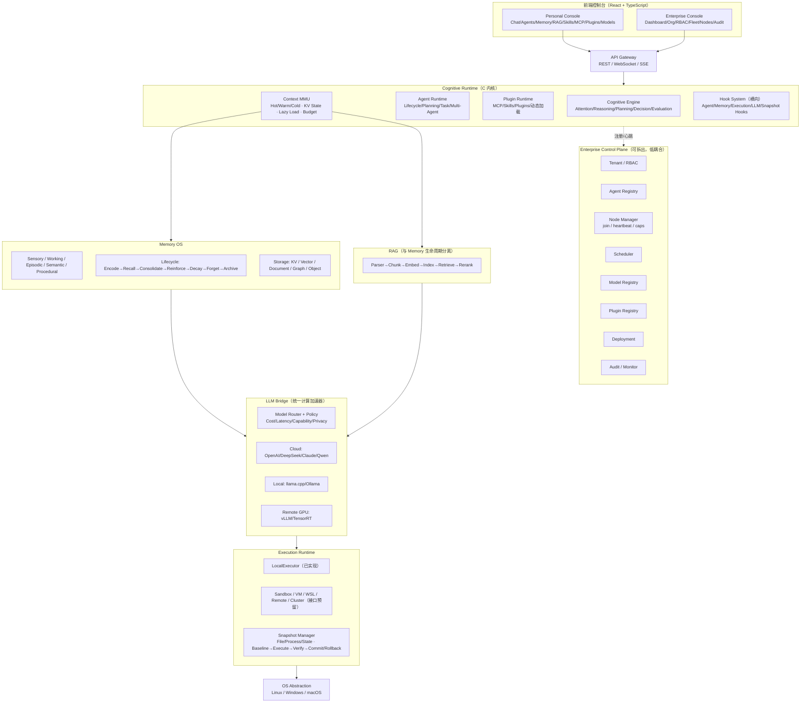

**核心思想**：LLM 是 Cognitive OS 的**计算加速器，而不是 OS 本身**。类脑思考用 `代码流 + 规则引擎 + 状态机 + LLM` 混合实现，LLM 只在需要泛化判断时介入。

---

## 二、核心设计哲学：认知闭环（代码逻辑主环）

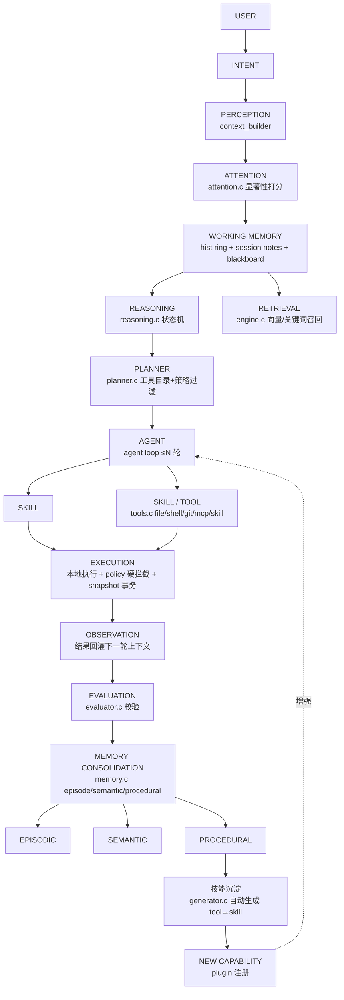

对应现有代码主入口：`cagent_run()` → `ca_reasoning_run()`（src/cognition/reasoning.c，REASON→PLAN→ACT→VERIFY→LEARN 状态机，src/runtime/state_machine.c）。

---

## 三、模块依赖规则（比目录更重要）

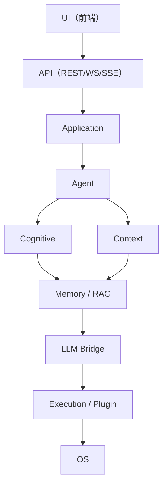

**铁律：底层绝不反向依赖上层。**
- `memory/` 不得 `#include "agent.h"`、`"llm.h"`
- 依赖倒置通过四个接口族实现：`MemoryBackend` / `LLMProvider` / `Executor` / `Plugin`
- 现有代码已遵守的示例：`ca_reasoning_config`（reasoning.h）只持有接口指针（llm/tools/memory/policy/bus 均为不透明 struct），memory 层不知道 agent 层存在。

---

## 四、Memory OS（类型与服务分离）

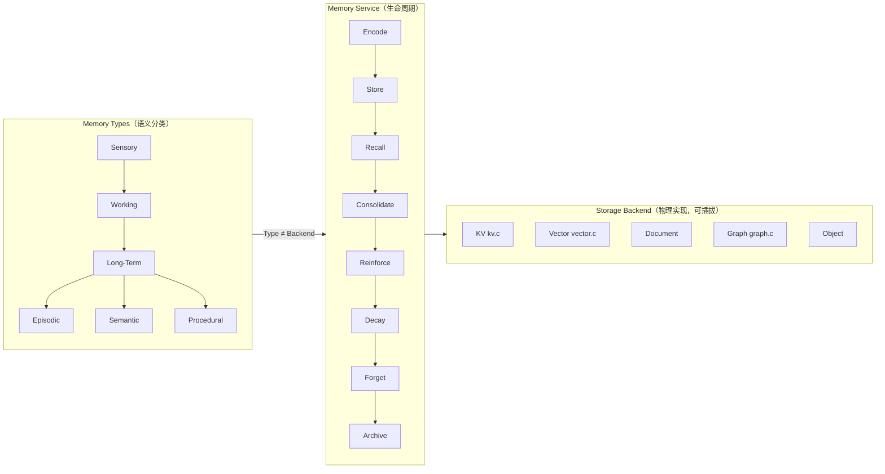

**禁止绑定**：`Semantic = Vector DB`、`Episodic = Document DB` 这类绑定不存在——任何 Memory Type 可以落到任何 Backend。
现有代码：`src/memory/{memory,kv,episode,vector,graph}.c`，embedding 本地哈希+CJK bigram 回退（embedding.c），cloud/本地 fallback 在 `ca_memory` 内部选择。
RAG 与 Memory **共享** Embedding/VectorStore/Reranker，但**生命周期不混**（外部知识 vs 用户/Agent 经验）。

### Memory 自进化闭环（差异化能力）

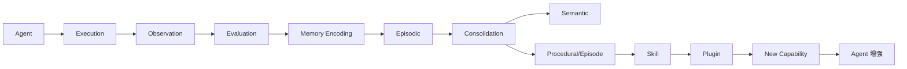

现状：自进化闭环已有骨架（失败→generator.c 生成工具→注册→generated_tools.json 持久化→启动回绑）；巩固（Consolidation，episodic→semantic/procedural 的自动沉淀）是下一步重点。

---

## 五、Context MMU

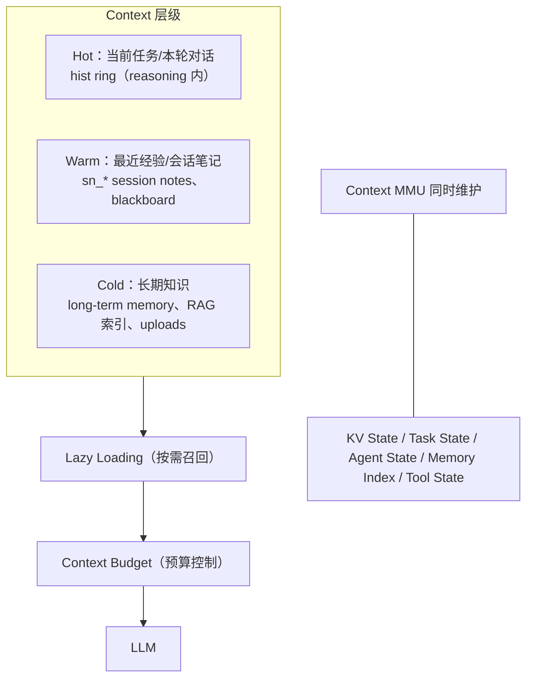

目的：**LLM 不需要每次重读全部历史**。现有部分实现：hist ring + compact_history（压缩）、attention 显著性、RAG 召回、chat history JSON；✅ 显式 budget 配额与跨层自动降级已于 2026-09-02 落地（`context.budget_*`）。

---

## 六、Agent Runtime 与生命周期

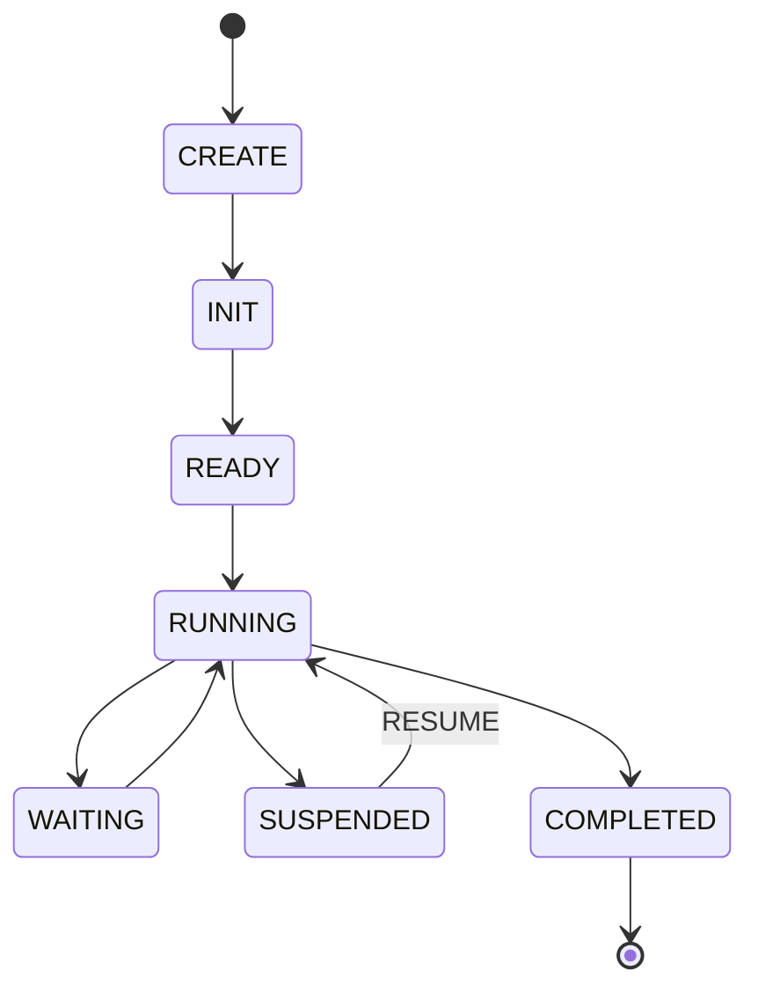

Agent 组成：Identity / State / Policy / Memory / Context / Skills / Tools / Permissions / Scheduler / Lifecycle。
Multi-Agent 默认隔离五项：Namespace、Memory、Context、Tool、Permission（现有实现：每 agent 独立 `ca_reasoning` 实例 = 历史/会话笔记隔离；共享 llm/tools/memory/policy/bus/metrics 均有锁；无锁的 index/snapshot 明确不共享）。

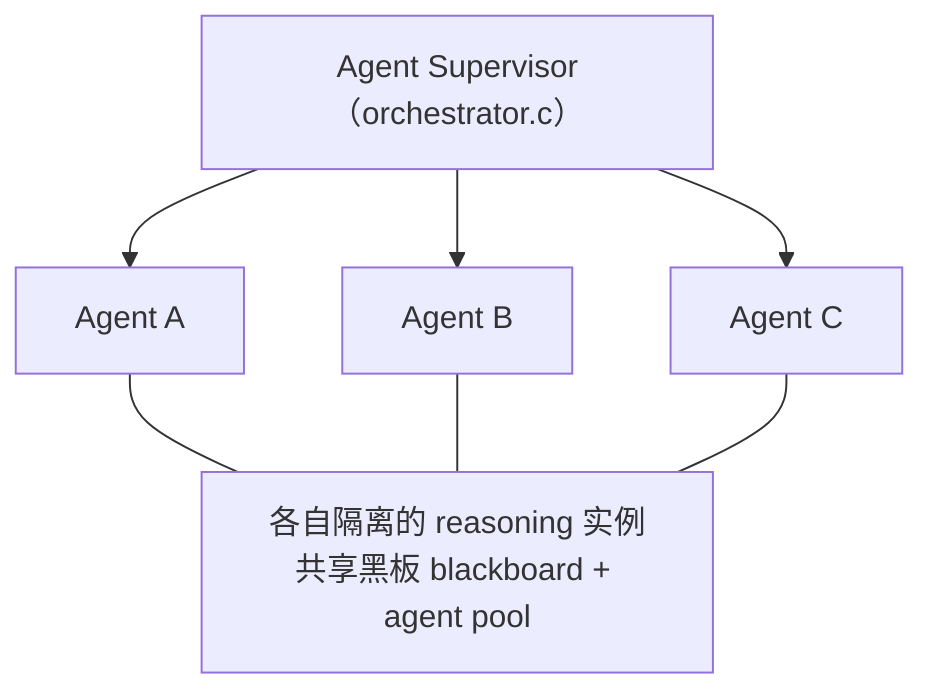

三种多 agent 形态（已收敛为一套引擎）：
| 形态 | 计划由谁定 | 执行引擎 |
|---|---|---|
| 单 agent（对话） | LLM 自主 | reasoning loop |
| 自动编排（orchestrate） | LLM 分解 → DAG | ca_flow_run |
| 手写 Flow | 用户显式 DAG | ca_flow_run |

---

## 七、Hook 系统（横向能力，第三方零侵入扩展）

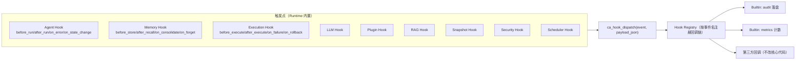

现有实现：`src/runtime/hook.c`（注册/派发/拦截语义）+ reasoning、tool 执行接入点；REST `GET/POST/DELETE /v1/hooks` 供外部（含插件）注册。

---

## 八、Coroutine 统一异步模型

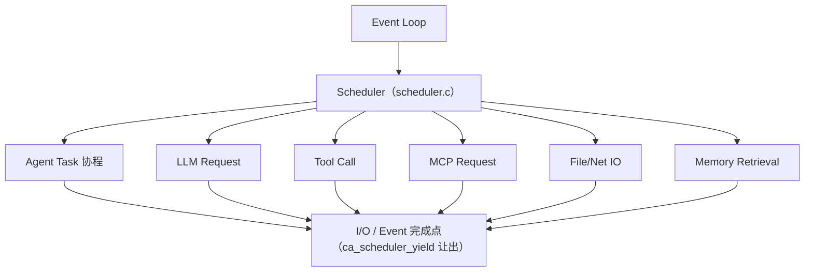

原则：**异步一律协程，不再新增 pthread_create 长驻线程**（例外：与外部世界的边界——HTTP server、WS、channel poller、cluster heartbeat）。
现有实现：`src/os/os_coro.c` + scheduler 合作式调度；HTTP 路由内严禁阻塞，长任务走 `ca_scheduler_submit`（chat/orchestrate/flow 均此模式）。

---

## 九、Execution Runtime 与 Snapshot

```c
/* include/cagent/execution/executor.h —— 稳定接口，未来 VM/Sandbox 不改 Agent Runtime */
typedef struct ca_executor_ops {
    int  (*create)(void *impl, const char *config_json);
    int  (*start)(void *impl);
    int  (*execute)(void *impl, const char *tool, const char *args_json, char **result);
    int  (*stop)(void *impl);
    void (*destroy)(void *impl);
    int  (*snapshot)(void *impl, char **snapshot_id);
    int  (*restore)(void *impl, const char *snapshot_id);
} ca_executor_ops;
```

现状：`LocalExecutor` 已落地（execution/executor.c，实现 `ca_executor_ops`，reasoning 的 ACT 阶段经它调 tool registry）；`SandboxExecutor`（wasm3）已有独立沙箱（plugin_runtime/sandbox）。沙箱已内置 **FileTracker 文件访问追踪**（plugin_runtime/filetracker）：配置 workspace 后，每次沙箱运行记录命令读取的路径 token（READ）、前后快照对比出的新建/改写（WRITE）与删除（DELETE），以 `files_json` 随结果返回——支撑"这个插件动了哪些文件"审计与后续自动回滚。

Snapshot 哲学：**Runtime 原生能力，不是 git**。Baseline→Execute→Verify→Commit/Rollback；现有 `snapshot/`+`tx/`（use_transaction 时 ACT 失败自动回滚）。

---

## 十、代码逻辑图：三条关键时序

### 10.1 单 agent 主循环（cagent_run）

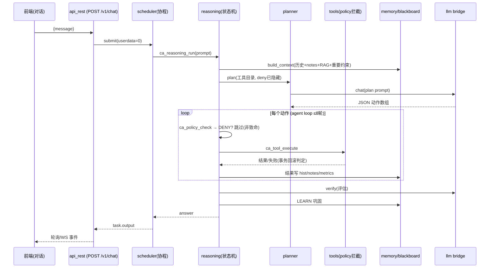

### 10.2 Flow 编译执行（自动编排与手写 DAG 同路径）

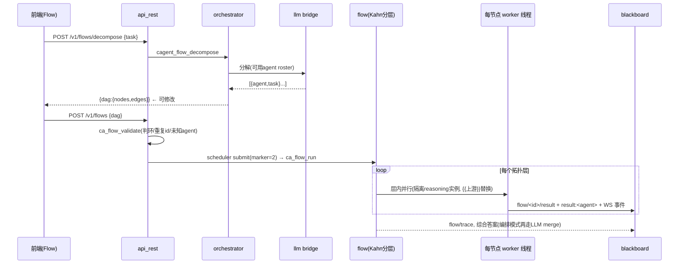

### 10.3 分布式节点生命周期（企业版雏形）

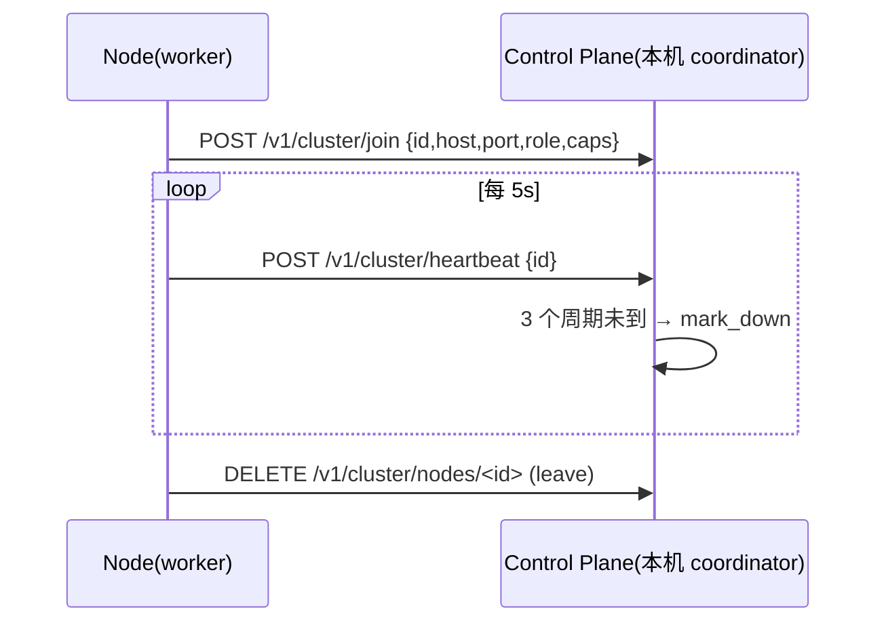

---

## 十一、设计模块 → 现有代码映射（代码逻辑图·静态视图）

| 设计模块 | 现有实现 | 状态 |
|---|---|---|
| core/runtime（event loop/scheduler/lifecycle） | src/runtime/scheduler.c, state_machine.c, task.c, os/os_coro.c | ✅ |
| event bus | src/runtime/event_bus.c → WS 广播 | ✅ |
| hook 系统 | src/runtime/hook.c（v1.0 新增） | ✅ 本轮 |
| cognitive engine（attention/reasoning/planning/evaluation） | src/cognition/{attention,reasoning,planner,evaluator}.c | ✅（reflection 部分=自进化） |
| agent runtime（lifecycle/multi-agent） | src/cagent.c(agent_run/run), runtime/{agent,orchestrator,flow}.c | ✅ |
| context MMU | hist ring + compact + session notes + attention + retrieval | ✅（budget 显式配额+自动降级 2026-09-02；Context 状态槽 KV/Task/Agent State 收拢到 runtime/state_store.c + REST /v1/state 2026-09-04） |
| memory OS | src/memory/{memory,kv,episode,vector,graph}.c | ✅（lifecycle reinforce/decay/forget/archive + consolidation 自动化 ✅ 2026-09-04） |
| memory service 接口 | include/cagent/memory/service.h + src/memory/service.c（type↔backend 解耦：working/episodic/semantic/procedural 四类型 vtable；default backend = ca_memory facade；REST GET /v1/memory/service） | ✅ 2026-09-04 |
| RAG | src/retrieval/{engine,context_builder,embedding}.c | ✅ 两阶段检索（hybrid 召回→rerank 重排→混合排序）、MQE、HyDE（retrieval.hyde 配置，默认关）✅ 2026-09-04 |
| llm bridge + router | src/llm/{llm,router,openai,anthropic,mock,sse,usage}.c | ✅（caps 查询 ca_llm_capabilities + cancel 中断 ✅ 2026-09-04；policy 路由 🟡） |
| capability（tool/skill/mcp/plugin） | src/action/tools.c + tool_*.c, skill.c, mcp_conn.c, plugin_runtime/* | ✅ |
| 自进化 generator | src/plugin_intelligence/generator.c + generated_tools.json | ✅ |
| execution runtime | execution/executor.c LocalExecutor + WSL/Remote 路由执行器（shell 经 `wsl.exe`/`ssh` 重写，非 shell 工具透传；config `execution.backend`/`execution.remote_host`） | ✅（ExecutorOps 收拢完成；VM 沙箱已有 wasm3 sandbox） |
| snapshot/tx | src/snapshot, src/tx | ✅ |
| process/state snapshot | ca_cagent_state_export/import（cagent.c：state store + long-term facts + agent roster + llm config 打包为单 JSON）；REST POST /v1/state/snapshot、/v1/state/restore | ✅ 2026-09-04 |
| policy/权限 | src/runtime/policy_engine.c（规划隐藏+执行硬拦截+持久化） | ✅ |
| cluster/心跳 | src/cluster/node.c + cagent.c heartbeat_loop | ✅ |
| protocol（HTTP/WS） | src/api/{http_server,websocket,api_rest}.c + web_ui.h | ✅ |
| 前端 | apps/web/index.html（单文件 React 风格，构建期嵌入） | 🟡 个人版功能齐全；React 拆分 ⬜ |
| enterprise control plane | 多租户/RBAC/部署 ⬜（cluster 心跳为最早雏形） | ⬜ |

---

## 十二、开发路线（依总纲优先级）

1. **core/runtime**：✅ 协程调度器/事件总线/状态机已稳；✅ Hook 横向层已落地（src/runtime/hook.c：注册/派发/拦截语义 + agent.*/exec.* 事件接入 reasoning 与状态机 + 内置审计 hooks.jsonl + REST GET/POST/DELETE /v1/hooks）
2. **agent**：✅ 生命周期 + 隔离多 agent + Flow 统一引擎；待做：agent 持久化身份/权限（企业 RBAC 前置）
3. **context**：✅ Context Budget 显式配额（hot/warm/cold 字节预算 + 自动降级，2026-09-02）；✅ Context 状态槽收拢（runtime/state_store.c：KV/Task/Agent State 统一存储 + /v1/state REST + state.json 持久化，2026-09-04）
4. **memory**：✅ Consolidation 自动化（2026-09-02）；✅ lifecycle（reinforce/decay/forget/archive，2026-09-04）；✅ Memory Service 接口层（type↔backend 解耦 vtable，2026-09-04）
5. **llm**：✅ 路由策略（cost/latency/capability，2026-09-02）；✅ caps 查询 + cancel（2026-09-04）
6. **execution**：✅ tool 执行收拢到 `ca_executor_ops`（Local，2026-09-02）；✅ WSL/Remote 路由执行器 + 进程/状态快照（2026-09-04）
7. **plugin**：✅ 生成/注册/持久化闭环；待做：分发/签名/灰度（企业）

**P2（暂缓）**：可视化画布、OS 级沙箱、符号代码索引、SWE-bench harness、React 前端拆分。（MQE/HyDE/Rerank 已于 2026-09-04 完成，移出 P2）
